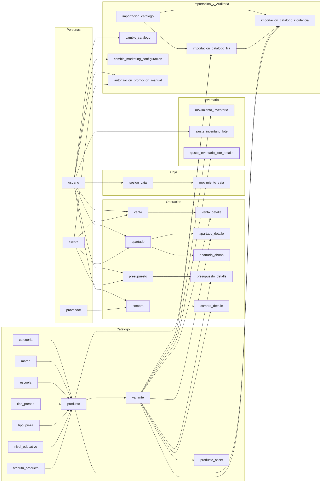
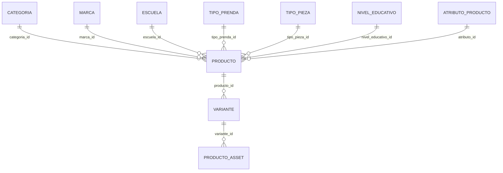
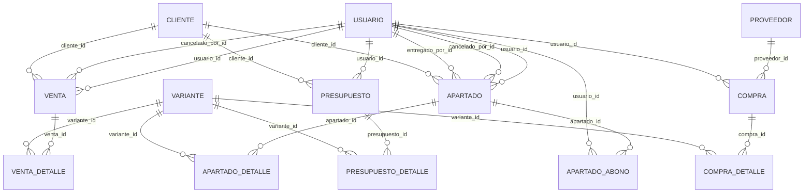
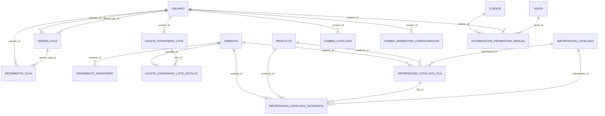

# Diagrama actual de base de datos

Fuente de verdad usada para este mapa:

- `pos_uniformes/database/models.py`
- Metadata ORM cargada desde `pos_uniformes/.venv`

Estado observado hoy:

- 35 tablas en el esquema actual de `pos_uniformes`
- `variante` es el nodo mas conectado del catalogo y de las operaciones
- `cliente` y `usuario` funcionan como ejes transversales de ventas, apartados, presupuestos, caja y auditoria
- `configuracion_negocio` y `sku_sequence` son tablas aisladas de configuracion

## Vista general

## Catalogo

Lectura rapida:

- `producto` representa la familia o ficha base
- `variante` representa el SKU vendible con talla, color, precio y stock
- las tablas de catalogo alrededor de `producto` normalizan escuela, tipo de prenda y atributos
- `producto_asset` cuelga de `variante`, no de `producto`

## Operacion comercial

Lectura rapida:

- ventas, apartados y presupuestos comparten el patron `cabecera -> detalle`
- `cliente` es opcional en varios flujos, pero ya esta ligado a ventas, apartados y presupuestos
- `apartado` tiene una capa extra de pagos parciales en `apartado_abono`
- compras alimentan inventario por `variante`, no directamente por `producto`

## Caja, inventario, importacion y auditoria

Lectura rapida:

- `sesion_caja` y `movimiento_caja` cubren apertura, cierre y movimientos manuales
- `movimiento_inventario` es el historial operativo por SKU
- los ajustes masivos tienen cabecera en `ajuste_inventario_lote` y detalle por variante
- importaciones guardan corrida, filas procesadas e incidencias separadas
- auditoria de catalogo y marketing esta modelada como historial orientado a usuario

## Tablas de soporte o configuracion

Estas tablas no son hubs relacionales fuertes, pero forman parte del esquema:

- `configuracion_negocio`
- `sku_sequence`

## Donde veo mas densidad hoy

Si queremos seguir ordenando el modelo, los centros de gravedad actuales son:

1. `variante`: inventario, compras, ventas, apartados, presupuestos, assets e importacion
2. `usuario`: ventas, apartados, compras, caja, auditoria y autorizaciones
3. `cliente`: ventas, apartados, presupuestos, promociones manuales y nivel de lealtad

## Siguiente mejora util para este mapa

Si te sirve, el siguiente paso natural es sacar una version "solo negocio" con menos tablas tecnicas, por ejemplo:

- catalogo y stock
- ventas y apartados
- clientes y lealtad
- caja

Esa version seria mejor para discutir flujo con equipo no tecnico.
