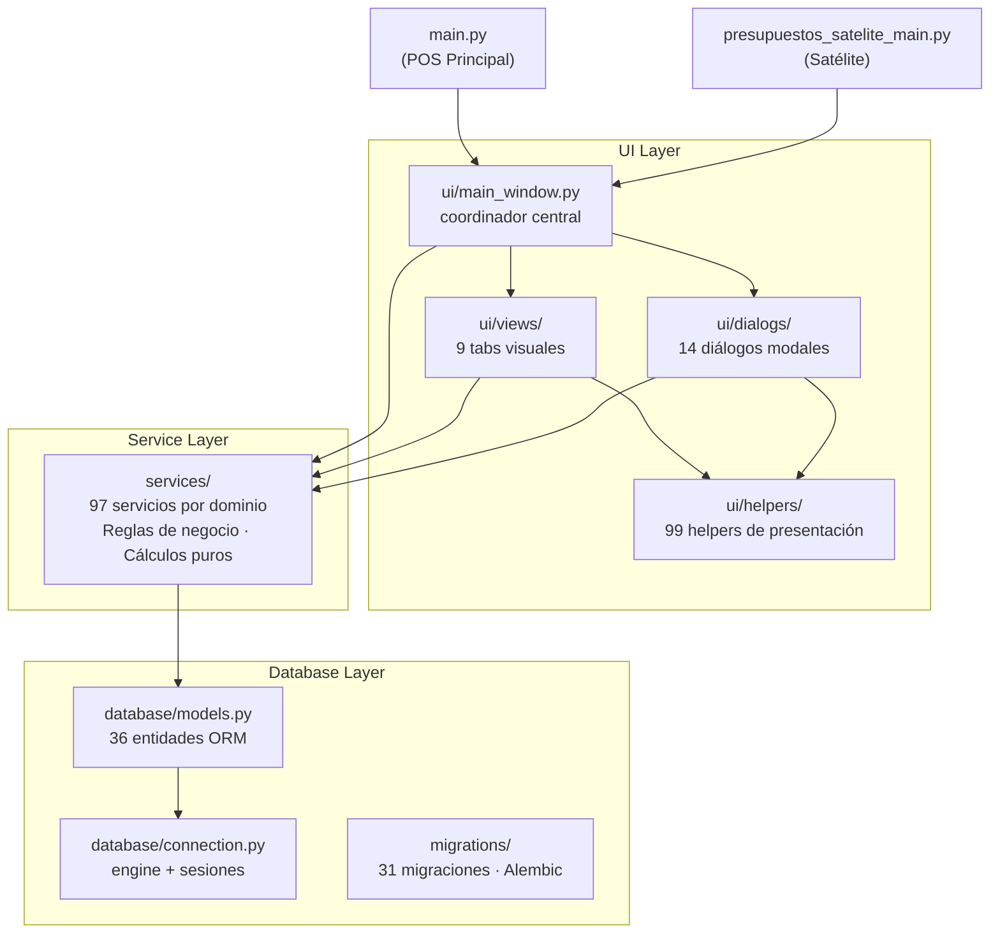
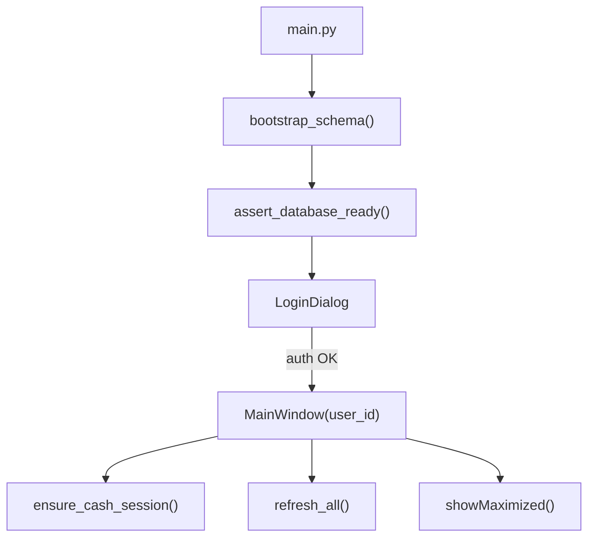
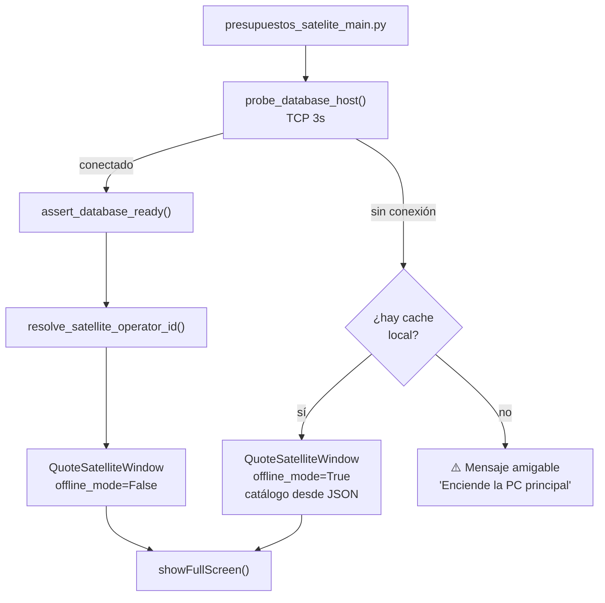

# Arquitectura General

## Stack tecnológico

| Capa | Tecnología |
|------|-----------|
| Interfaz | PyQt6 |
| Base de datos | PostgreSQL |
| ORM | SQLAlchemy |
| Migraciones | Alembic |
| Lenguaje | Python 3 |
| Empaquetado | PyInstaller (Windows) |

---

## Capas del sistema



---

## Flujo de arranque — POS Principal



## Flujo de arranque — Satélite



---

## Reglas arquitectónicas del proyecto

1. **Un bloque funcional por vez** — no mezclar refactor con feature nueva
2. **`ui/main_window.py` como coordinador** — no meterle reglas densas nuevas
3. **Regla de negocio → `services/`** — si es cálculo puro, extrae
4. **Presentación → `ui/helpers/`** o `ui/dialogs/`
5. **Todo cambio sensible cierra con checkpoint** en `docs/historial_refactors.md`
6. **Si toca Caja, descuentos o inventario:** pruebas + validación manual obligatorias

---

## Verificaciones mínimas antes de cualquier cambio

```bash
./.venv/bin/python scripts/check_startup_health.py
./.venv/bin/python -m unittest discover -s tests -p 'test_*.py'
```

---

## Estructura de directorios

```
pos_uniformes/
├── main.py                        ← entrada POS principal
├── presupuestos_satelite_main.py  ← entrada satélite
├── database/
│   ├── models.py       (1,386 líneas)
│   ├── connection.py
│   └── preflight.py
├── ui/
│   ├── main_window.py  (coordinador central — más sensible del sistema)
│   ├── login_dialog.py
│   ├── quote_satellite_window.py
│   ├── views/          (9 archivos)
│   ├── dialogs/        (14 archivos)
│   ├── helpers/        (99 archivos)
│   └── styles/
├── services/           (97 servicios)
├── utils/
├── scripts/            (21 archivos)
├── tests/              (224 archivos · ~660 tests)
├── migrations/
└── docs/               (documentación interna del proyecto)
```

---

## Relaciones entre capa y herramienta

| Quiero cambiar... | Busco en... |
|-------------------|-------------|
| Ventas / cobro / carrito | `ui/views/cashier_view.py` + `services/venta_service.py` + `services/sale_*` |
| Apartados | `ui/views/layaway_view.py` + `ui/dialogs/create_layaway_dialog.py` + `services/layaway_*` |
| Catálogo / Inventario | `ui/views/products_view.py` + `ui/views/inventory_view.py` + helpers de tabla/filtros |
| Respaldos | `services/backup_service.py` + `scripts/backup_database.py` |
| Fechas visibles | `utils/date_format.py` + `ui/helpers/date_field_helper.py` |
| Presupuestos | `ui/views/quotes_view.py` + `services/quote_*` + `services/presupuesto_service.py` |

→ Ver [[03 - Mapa de Módulos UI]] y [[00 - Índice General]]
