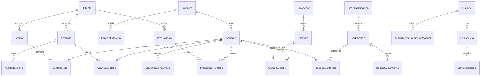

# Base de Datos

**Archivo principal:** `database/models.py`
**Motor:** PostgreSQL · SQLAlchemy ORM · Alembic para migraciones

---

## Inicialización

### `database/connection.py`
- Configura el engine con `settings.database_url`
- `SessionLocal` con `autoflush=False, expire_on_commit=False`
- `get_session()` — context manager para sesiones
- `init_db()` — crea tablas con `Base.metadata.create_all()`

### `database/preflight.py`
- Verifica que la BD esté sincronizada con Alembic antes de abrir la app
- Compara `current_heads` vs `expected_heads` de migraciones
- Lanza `DatabasePreflightError` si la BD está desactualizada

---

## Entidades (56 tablas)

### Usuarios y autenticación

| Tabla | Descripción |
|-------|-------------|
| `Usuario` | Usuarios del sistema con roles ADMIN / CAJERO |

**Campos clave:** `username`, `password_hash`, `rol` (enum), `activo`

---

### Caja

| Tabla | Descripción |
|-------|-------------|
| `SesionCaja` | Sesión de caja: apertura, cierre, fondo inicial, total esperado |
| `MovimientoCaja` | Ingresos, retiros y reactivos registrados en sesión |

---

### Catálogo

| Tabla | Descripción |
|-------|-------------|
| `Producto` | Producto base con `nombre_base` |
| `Variante` | SKU individual con talla, color, precio, `stock_actual`, `stock_bodega`, `stock_piso`, `stock_minimo`, `ultimo_conteo_at`. Propiedad `stock_tienda = stock_actual - stock_bodega - stock_piso` |
| `Categoria` | Categoría de producto |
| `Marca` | Marca |
| `Escuela` | Escuela asociada a uniformes |
| `TipoPrenda` | Tipo de prenda (camisa, pantalón, etc.) |
| `TipoPieza` | Pieza del uniforme |
| `NivelEducativo` | Nivel (primaria, secundaria, etc.) |
| `AtributoProducto` | Atributos genéricos adicionales |
| `ProductoAsset` | Imágenes y assets de productos |
| `CambioCatalogo` | Auditoría: CREACION / ACTUALIZACION / ESTADO / ELIMINACION |
| `CatalogSchoolProductLink` | Liga manual escuela ↔ producto general (guiado, tarifario). En transición: la mantiene en espejo `uniforme_service`; se retira en la fase 2b |
| `ConjuntoComponente` | **2026-09-21, catálogo fase 3:** receta de Pants 3pz / Chamarra (conjunto_id, componente_id, cantidad >0 se lleva / <0 deja). `registrar_movimiento` descompone la venta y recalcula el stock (`derivado:`). Migración `2d3e4f5a6b7c`. Ver [[38 - Catálogo Fase 2 - Uniformes]] §5b |
| `Uniforme` / `UniformePieza` | **2026-09-21, catálogo fase 2:** un uniforme por escuela; cada pieza señala un producto (propio o general) con `grupo` (Diario/Deportivo/Escolta/Accesorio/Otro), `orden`, `obligatoria`, `color`, `nota`, `activo` (quitar = inactiva). Migración `1c2d3e4f5a6b`. Ver [[38 - Catálogo Fase 2 - Uniformes]] |

---

### Inventario

| Tabla | Descripción |
|-------|-------------|
| `MovimientoInventario` | Trazabilidad completa de movimientos |
| `AjusteInventarioLote` | Encabezado de ajuste masivo auditable |
| `AjusteInventarioLoteDetalle` | Detalle de cada linea del ajuste masivo |
| `ConteoInventario` | Registro de conteo fisico: variante, stock_sistema vs stock_fisico, diferencia, ajustado. `escuela_id` NULL = conteo de productos básicos. **2026-09-10:** `jornada_id` (FK a `conteo_jornada`, NULL en los viejos). **2026-09-13:** `pedido_sugerido`, `pedido`, `pedido_decidido_at` — lo que Daniel decidió pedir al revisar y lo que se le sugirió (migración `bc2d3e4f5a6b`). Ver [[37 - Revisar y Pedidos]] |
| `EmpleadaPago.en_cajon` / `CajaRetiro.en_cajon` | **2026-09-19:** False = no salió del cajón en el periodo del corte; no se resta (migración `0b1c2d3e4f5a`). Ver [[33 - Caja, Nómina y Corte Automático]] |
| `ConteoJornada.hojas_impresas` / `impresa_at` | **2026-09-18:** imprimir la hoja abre la jornada (migración `f06b7c8d9e0f`). Ver [[36 - Conteos por Jornada]] |
| `ConteoJornada.prenda` | **2026-09-14:** una sola prenda de básicos (nombre del producto), `""` = todo el tipo (migración `de4f5a6b7c8d`). Ver [[36 - Conteos por Jornada]] |
| `ConteoJornada` | **Jornada de conteo (2026-09-10)**: quién (`empleada_code`/`empleada_nombre`), qué (`escuela_id` o `tipo_pieza` para básicos), `titulo`, `iniciada_at`, `terminada_at` (NULL = a medias), `revisada_at`/`revisada_por` (NULL = Daniel no la ha aplicado), `total_tallas`, `notas` (`descartada` si se descartó). Migración `ab1c2d3e4f5a`. Ver [[36 - Conteos por Jornada]] |
| `ConfigConteoEscuela` | Config por escuela: dias_vigencia para frecuencia de reconteo (default 90). La frecuencia de **productos básicos** es global: columna `dias_vigencia_basicos` en `ConfiguracionNegocio` (2026-07) |
| `Recordatorio` | Recordatorios del calendario (2026-07): tipo pago/descanso/nota, título, monto opcional, recurrencia única (fecha) / mensual (día del mes) / semanal (día de semana), notas. Compartido entre PCs |
| `RecordatorioCompletado` | Marca de que una ocurrencia de un recordatorio ya se hizo/pagó (recordatorio_id + fecha de la ocurrencia, único). Cascade al borrar el recordatorio |
| `LibretaVenta` | **Libreta digital (2026-09)**: cada venta/apartado/abono del mostrador, ligado al gafete. Campos: tipo, piezas, `comisiones` (3pz=2 desde 2026-09-06), `monto_total`/`monto_neto` (4.5% tarjeta), `pago_tarjeta`, `detalle` JSONB, origen. Migraciones `o8c9d0e1f2a3` + `p9d0e1f2a3b4`. Ver [[28 - Libreta Digital]] |

> [!warning] `libreta_venta` arranca el **2026-09-02**
> Una consulta "de los últimos 60 días" sobre la Libreta devuelve en realidad ~9 días. Verificar el rango antes de reportar un periodo: ya provocó un reporte con la etiqueta de tiempo equivocada (2026-09-10).

| `EmpleadaHorario` | **Calendario (2026-09-04)**: descanso fijo semanal, `ciclo_dias_pago` (7 = mismo día cada semana), `fecha_ultimo_pago`. Migración `q0e1f2a3b4c5`. **2026-09-08** (`u4c5d6e7f8a9`): `modo_pago` "semana"/"por_dia" y `dias_trabajo` (JSON de weekdays) para las que solo trabajan ciertos días. Ver [[30 - Calendario de Empleadas]] |
| `EmpleadaEvento` | Excepciones por día: falta / descanso (movido) / trabajo / pago, con `nota` de auditoría ("intercambio con X", "apuntado por León"). Única por (código, fecha, tipo) |
| `LibretaCorte` | **Historial de cortes (2026-09-04)**: cifra final, ops, piezas, `creado_por` (VEND-1/ENC-1/AUTO). Migración `r1f2a3b4c5d6`. **Corte por periodo (2026-09-08, `t3b4c5d6e7f8`)**: `desde`/`hasta` (momento exacto), `reactivo_inicial`, `monto_esperado`, `retiros_pagos`, `otros_retiros`, `reactivo_final`. El ticket sigue sin imprimir esperado/diferencia. Ver [[33 - Caja, Nómina y Corte Automático]] |
| `CajaParametros` | **Una fila (id=1, 2026-09-08)**: `reactivo_actual` (fondo vigente, sembrado en 11,160), `sueldo_base` (1,300), `tarifa_comision` (2), `descuento_falta` (216.67). Editable en Libreta → ⚙ Caja y nómina |
| `EmpleadaPago` | Cada pago registrado con desglose: periodo, `comisiones`, `sueldo_base`, `tarifa_comision`, `monto_comisiones`, `faltas`, `descuento_faltas`, `total`, `creado_por`, y en modo por día `dias_trabajados`/`tarifa_dia`. El corte lo descuenta del cajón |
| `CajaRetiro` | Dinero que salió del cajón por algo que no es pago (proveedor, renta, cambio…): `monto`, `motivo`, `creado_por`. Migración `v5d6e7f8a9b0` |
| `AfluenciaHora` | Personas que entran/salen/pasan por cámara y hora (`camara`, `hora`, `entradas`, `salidas`, `pasan`; única por cámara+hora). La escribe `afluencia/contador_afluencia.py`. Migración `s2a3b4c5d6e7`. Ver [[32 - Cámaras y Afluencia]] |
| `DemandaNoAtendida` | **Lo que pidieron y no se pudo vender (2026-09-10)**: `tipo` (`busqueda_vacia` / `talla_agotada` / `carrito_vacio`), `texto`, `sku`, `producto`, `talla`, `piezas`, `employee_code`, `origen`. Se llena sola desde el kiosko, sin que nadie llene formularios. Migración `z9b0c1d2e3f4`. Ver [[35 - Demanda No Atendida]] |

**Tipos de movimiento:** `ENTRADA_COMPRA`, `SALIDA_VENTA`, `AJUSTE_*`, `APARTADO_*`

**Migracion conteo:** `29e11361cabd` (down: `c3d4e5f6a7b8`)

---

### Clientes y Lealtad

| Tabla | Descripción |
|-------|-------------|
| `Cliente` | Cliente con nivel de lealtad y descuento preferente |

**Campos clave:**
- `nivel_lealtad`: BASICO / LEAL / PROFESOR / MAYORISTA
- `tipo_cliente`: GENERAL / PROFESOR / MAYORISTA (enum)
- `descuento_preferente`
- `nivel_asignado_por_user_id`
- `card_image_path`

---

### Compras y Proveedores

| Tabla | Descripción |
|-------|-------------|
| `Proveedor` | Proveedores activos/inactivos |
| `Compra` | Orden de compra a proveedor |
| `CompraDetalle` | Líneas de la compra |

**Estados de compra:** BORRADOR / CONFIRMADA / CANCELADA

---

### Ventas

| Tabla | Descripción |
|-------|-------------|
| `Venta` | Venta confirmada, con referencia a Usuario y Cliente |
| `VentaDetalle` | Líneas de la venta |

**Estado:** `EstadoVenta` enum → BORRADOR / CONFIRMADA / CANCELADA
**Campo notable:** `ModoOrigenVenta` — venta normal, por empleada o directo

---

### Apartados

| Tabla | Descripción |
|-------|-------------|
| `Apartado` | Reserva con `saldo_pendiente` |
| `ApartadoDetalle` | Líneas del apartado |
| `ApartadoAbono` | Pagos parciales registrados |

**Estados:** ACTIVO / LIQUIDADO / ENTREGADO / CANCELADO

---

### Presupuestos

| Tabla | Descripción |
|-------|-------------|
| `Presupuesto` | Cotización sin afectar inventario |
| `PresupuestoDetalle` | Líneas del presupuesto |

**Estado:** `EstadoPresupuesto` → BORRADOR / EMITIDO / CANCELADO / CONVERTIDO

---

### Configuración y Marketing

| Tabla | Descripción |
|-------|-------------|
| `ConfiguracionNegocio` | Settings: descuentos por nivel, templates WhatsApp, info transferencias |
| `AutorizacionPromocionManual` | Auditoría de descuentos manuales con `authorization_code_hash` |
| `CambioMarketingConfiguracion` | Auditoría de cambios en marketing |

---

### Importaciones y Empleadas

| Tabla | Descripción |
|-------|-------------|
| `ImportacionCatalogo` | Historial de importaciones |
| `ImportacionCatalogoFila` | Filas individuales importadas |
| `ImportacionCatalogoIncidencia` | Errores o advertencias de importación |

**Tabla `Empleada`:** `id`, `codigo`, `nombre_completo`, `pin_hash`, `activo` ✅ existe desde migración `b1d8f0e4c231`

**Campos nuevos en `Variante` (migración `a1b2c3d4e5f6`):**
- `stock_minimo` (nullable int) — mínimo aceptable; activa alerta visual y filtro "Bajo mínimo" en inventario
- `ultimo_conteo_at` (nullable datetime TZ) — timestamp del último conteo físico; muestra "Hoy / Ayer / Hace Nd / Nunca"

---

### Bodega (mini-WMS)

> Migración `a1b3c5d7e9f0` — 4 tablas nuevas.
> Migración `d5e6f7a8b9c0` — `stock_bodega` y `stock_piso` en Variante (INTEGER DEFAULT 0, CHECK >= 0).
> `stock_actual` sigue siendo el total global. `stock_tienda = stock_actual - stock_bodega - stock_piso` (derivado, no almacenado).

| Tabla | Descripción |
|-------|-------------|
| `BodegaUbicacion` | Rack + nivel físico (ej. "A1-N2"). UNIQUE(rack, nivel). Campo `activo` para desactivar. |
| `BodegaCaja` | Caja de almacenamiento con código único, FK a ubicación. Estado: ACTIVA / VACIA / CERRADA. |
| `BodegaContenido` | Qué variante hay en qué caja y cuánta cantidad. UNIQUE(caja_id, variante_id), CHECK(cantidad > 0). |
| `BodegaMovimiento` | Log append-only de movimientos: INGRESO, RETIRO, TRANSFERENCIA, MOVER_CAJA, CREAR_CAJA, AJUSTE. |

**Fórmula clave:**
```
stock_en_tienda = variante.stock_actual - sum(bodega_contenido.cantidad WHERE variante_id = X)
```

**Constraint lógico (en servicio, no en DB):**
```
sum(bodega_contenido.cantidad) <= variante.stock_actual
```

---

## Diagrama simplificado de relaciones



---

## Migraciones

```bash
# Verificar estado
python -m alembic current

# Aplicar pendientes
python -m alembic upgrade head

# Crear nueva migración
python -m alembic revision --autogenerate -m "descripcion"
```

> Si la app marca que la base está desactualizada, correr `upgrade head` antes de continuar.

- `alerta_telegram` (w6e7f8a9b0c1, 2026-09-09): cola de alertas para el bot de Telegram. Ver [[34 - Telegram y Resumen Diario]].
- `libreta_venta.privado` (x7f8a9b0c1d2, 2026-09-09): booleano. Un cobro **con tarjeta** marcado como privado desaparece del corte y de todo lo que ve el encargado. Solo tarjeta: ocultar efectivo descuadraría el cajón. Ver [[28 - Libreta Digital]].
- `tipo_pieza` "Licra" (5a6b7c8d9e0f, 2026-09-22): la licra no tenía tipo y el mapa le hacía un mosaico "Sin tipo". Ver [[07 - Servicios - Catálogo e Inventario]].
- `conjunto_componente.grupo` (3e4f5a6b7c8d) y su reparación (4f5a6b7c8d9e, 2026-09-22): piezas alternativas ("playera de hombre **o** de mujer"). La 3e… va aparte porque la `2d3e4f5a6b7c` ya había corrido en la principal.
- `conjunto_componente` (2d3e4f5a6b7c, 2026-09-21): receta de los conjuntos artificiales. Pendiente en producción.
- `uniforme` + `uniforme_pieza` (1c2d3e4f5a6b, 2026-09-21): el uniforme de cada escuela como entidad. Pendiente en producción. Ver [[38 - Catálogo Fase 2 - Uniformes]].
- `caja_parametros.ocultar_tarjeta` (y8a9b0c1d2e3, 2026-09-10): booleano. Recuerda cómo dejó el dueño la casilla de ocultar los cobros con tarjeta en el corte (vale para el kiosko y la app).
