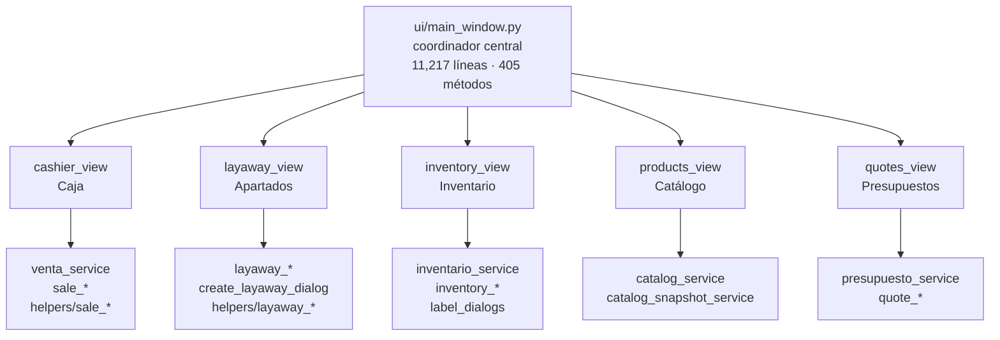

# Mapa de Módulos UI

> [!important] El POS adelgazó: de once pestañas quedan siete (2026-09-10)
> Ocultas: **Caja · Presupuestos · Apartados · Catalogo**. Su trabajo se mudó al kiosko — el corte se hace desde el satélite, los presupuestos en Presupuesto guiado, los apartados en Venta Rápida y el catálogo desde Panel Uniformes e Inventario.
>
> Los datos lo confirmaban: última sesión de caja 01/06, último presupuesto del POS 20/05, último apartado 20/03.
>
> **Se ocultan, no se borran.** Constante `PESTANAS_MUDADAS_AL_KIOSKO` en `ui/main_window.py`: quitar un nombre de ahí la vuelve a mostrar. El código y los datos siguen intactos — fueron la base del sistema.
>
> Quedan: **Resumen · Inventario · Bodega · Historial inventarios · Panel Uniformes · Analitica · Configuracion**.
>
> Dos efectos que conviene recordar:
> - El POS ya no puede quedarse parado en una pestaña oculta (antes caía fijo en la 1, que ahora es Caja): `_primera_pestana_visible()`.
> - El rol **CAJERO se queda sin pestañas visibles**, porque las suyas eran justo esas cuatro. Hoy no estorba (nadie entra al POS con ese rol); si algún día hace falta, hay que darle alguna.
>
> Ver [[08 - Servicios - Caja]] · [[35 - Demanda No Atendida]].

## El archivo más importante y sensible: `ui/main_window.py`

| Métrica | Valor |
|---------|-------|
| Líneas | 12,519 (2026-09-10) |
| Métodos totales | 405 |
| Métodos de negocio (`_handle_*`, `_validate_*`, `_apply_*`) | 137 |
| Imports de servicios | 67 |
| Imports de helpers | 87 |

**Regla vigente:** No meterle lógica nueva. Solo coordinación, orquestación y conexión de signals.

---

## Vistas — `ui/views/`

Cada vista construye la UI de un tab. No deben contener lógica de negocio.

| Archivo | Tab | Líneas | Notas |
|---------|-----|--------|-------|
| `cashier_view.py` | Caja | ~178 | Ventas rápidas, SKU, cobro |
| `products_view.py` | Catálogo | ~249 | Filtros, búsqueda, CRUD producto |
| `inventory_view.py` | Inventario | ~415 | Tab más compleja — etiquetas, conteo |
| `quotes_view.py` | Presupuestos | ~267 | Armar cotizaciones |
| `bodega_view.py` | Bodega | ~766 | Mini-WMS: cajas, ubicaciones, búsqueda, historial. Rediseñado 2026-05-25 |
| `layaway_view.py` | Apartados | ~169 | Reservas y abonos |
| `history_view.py` | Historial | ~164 | Ventas pasadas |
| `analytics_view.py` | Analítica | ~299 | Dashboards |
| `dashboard_view.py` | Dashboard | ~155 | Resumen operativo |
| `panel_uniformes_view.py` | Panel Uniformes | ~386 | QWebEngineView + QWebChannel bridge para conteo |
| `settings_view.py` | Configuracion | ~109 | Delegado a dialogos |

---

## Diálogos — `ui/dialogs/`

| Archivo | Tamaño | Función |
|---------|--------|---------|
| `catalog_product_dialog.py` | 1,852 líneas | CRUD completo de productos (modos Uniforme / Ropa normal) |
| `settings_dialogs.py` | 968 líneas | Formularios de configuración por sección |
| `inventory_count_dialog.py` | 662 líneas | Conteo físico V1 y V2 |
| `cash_session_prompt_dialogs.py` | 379 líneas | Prompts de apertura/cierre de caja |
| `create_layaway_dialog.py` | 414 líneas | Alta operativa de apartados |
| `layaway_payment_dialog.py` | 342 líneas | Registro de abonos y liquidación |
| `settings_prompt_dialogs.py` | 337 líneas | Confirmaciones de config |
| `payment_dialogs.py` | 330 líneas | Cálculo de cambio |
| `inventory_label_batch_dialog.py` | 262 líneas | Impresión por lote de etiquetas |
| `catalog_variant_dialog.py` | 285 líneas | Alta y edición de variantes/SKU |
| `inventory_label_dialog.py` | 294 líneas | Impresión individual de etiqueta |
| `printable_text_dialog.py` | ~180 líneas | Texto imprimible genérico; multi-ticket con `TicketPrintQueue` (`b63fcf5`); `unit_label` para reutilizarlo con otros documentos (`a4a0c1a`) |
| `marketing_history_dialog.py` | 58 líneas | Historial de cambios de marketing |
| `inventory_context_menu_dialog.py` | 28 líneas | Menú contextual de inventario |
| `quick_kiosk_dialog.py` | ~230 líneas | Consulta rápida de precios (Ctrl+K), siempre al frente |
| `conteo_print_dialog.py` | ~25 líneas | Preview e impresión de hojas de conteo — delega en `open_tickets_print_dialog` (antes tenía su propia cola QTimer con crash al cerrar, `a4a0c1a`) |

> ⚠️ `catalog_product_dialog.py` (1,852 líneas) tiene demasiada lógica interna — ver [[19 - Deuda Técnica]]

### Atajos de teclado globales

| Atajo | Contexto | Acción |
|-------|----------|--------|
| F2 | POS | Procesar venta |
| F6 | POS | Ventas recientes |
| F8 | POS | Focus en captura SKU |
| Escape | POS | Limpiar captura / cerrar |
| Ctrl+S | POS y satélite | Búsqueda rápida de producto |
| **Ctrl+K** | POS y satélite | **Consulta rápida de precios** (event filter global, funciona en modales) |
| Ctrl+Shift+B | POS | Backup rápido |
| Ctrl+P | Satélite | Imprimir etiqueta |
| Ctrl+Shift+A | Satélite | Admin satélite |
| Escape | Satélite — Venta Rápida | Cierra sesión de empleada y vuelve al gate QR |

---

## Helpers — `ui/helpers/` (104 archivos)

Los helpers manejan presentación, estado visual y flujos de acción por dominio.

### Por dominio

| Dominio | Cantidad | Prefijo |
|---------|----------|---------|
| Catálogo | 15 | `catalog_*` |
| Ventas | 16 | `sale_*` |
| Presupuestos | 12 | `quote_*` |
| Inventario | 12 | `inventory_*` |
| Configuración | 15 | `settings_*` |
| Analítica | 8 | `analytics_*` |
| Historial | 6 | `history_*` |
| Apartados | 9 | `layaway_*` |

### Por tipo

| Tipo | Descripción |
|------|-------------|
| `*_selection_helper` | Manejo de selecciones en tablas |
| `*_filter_helper` | Filtros complejos activos |
| `*_table_row_helper` | Formateo de filas de tabla |
| `*_summary_helper` | Resúmenes visuales |
| `*_detail_helper` | Panel de detalle expandido |
| `*_action_helper` | Flujos de acción |
| `*_feedback_helper` | Mensajes y validación visual |
| `*_action_guard_helper` | Protecciones antes de ejecutar acciones |

### Helpers transversales notables

| Helper | Función |
|--------|---------|
| `snapshot_cache_helper.py` | Cache de snapshots para UI |
| `flow_layout.py` | Layout dinámico (chips de filtros) |
| `busy_feedback_helper.py` | Spinner de loading |
| `window_close_helper.py` | Manejo de cierre seguro de ventana |
| `qt_image_scale_helper.py` | Escalado de imágenes |
| `active_filter_chip_helper.py` | Chips visuales de filtros activos |
| `ticket_print_layout_helper.py` | Helpers compartidos de layout box-drawing para tickets (`tk_top`, `tk_mid`, `tk_bot`, `tk_row`, `tk_line`, etc.) |
| `sale_cart_table_helper.py` | Formateo del carrito de venta con precio tachado Unicode para promo 3pz |
| `ticket_print_queue.py` | Cola de impresión inyectable para tickets secuenciales, segura ante cierre del diálogo (`b63fcf5`) |

---

## Ventana Satélite — `ui/quote_satellite_window.py` (~6,170 líneas)

Interfaz simplificada para kiosko/presupuestos en pantalla táctil. 7 páginas: Kiosko, Venta Rápida, Catálogo, Guiado, Presupuestos, Compartir, Tarifarios.
- Consulta catálogo real desde la BD de la PC principal (o cache JSON offline)
- No tiene tab de Caja ni módulos operativos; Venta Rápida solo imprime tickets, no registra en DB
- `ui/views/quick_sale_view.py` (~1,030 líneas) — página Venta Rápida (2026-06-10)
- Ver [[17 - App Satélite]] para detalle completo

---

## Estilos — `ui/styles/`

| Archivo | Contenido |
|---------|-----------|
| `main_window_styles.py` | Estilos base generales |
| `main_window_hero_cashier_styles.py` | Caja (el hero más grande) |
| `main_window_inventory_analytics_styles.py` | Tablas e inventario |
| `main_window_control_styles.py` | Controles genéricos |
| `interactive_hover_styles.py` | Estados hover e interactividad |

---

## Relación UI → Servicios

