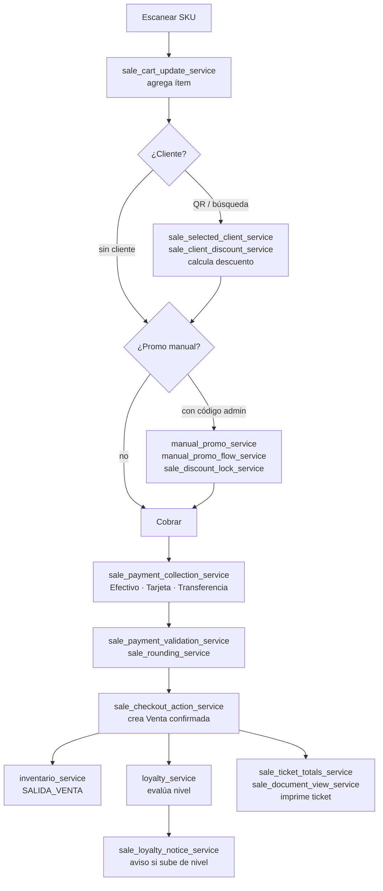

# Servicios — Ventas

**Dominio:** Caja, carrito, cobro, descuentos, ticket
**Cobertura de tests:** ~91%
**Archivos:** `services/venta_service.py` + 22 servicios `sale_*` + 2 `recent_sale_*`

---

## Núcleo

### `venta_service.py`
Crea borradores, confirma y cancela ventas.
- Valida usuario, stock e ítems
- Usa: `inventario_service`, `loyalty_service`
- Tests: ✓

### `sale_checkout_service.py`
Contexto pre-confirmación: snapshot del cliente y nivel previo.
- Valida transiciones de lealtad post-venta

### `sale_checkout_action_service.py`
Confirmación operativa: crea `Venta` confirmada, actualiza inventario.
- Usa: `venta_service`, `manual_promo_service`

---

## Carrito e ítems

### `sale_cart_update_service.py`
Actualizaciones de líneas del carrito (cantidad, precio, eliminar) sin re-escanear.
- Usa `build_ticket_product_name` para nombres cortos en el carrito
- Muestra precio tachado Unicode cuando aplica promo 3pz deportivo

### `sale_stock_policy.py`
Feature flag para permitir o bloquear oversell (`allow_negative_sale_stock()`).

---

## Descuentos

| Servicio | Función |
|---------|---------|
| `sale_discount_service.py` | Cálculo puro de descuentos por cliente e ítem |
| `sale_discount_context_service.py` | Orquesta descuentos manuales y de lealtad |
| `sale_discount_lock_service.py` | Previene cambios de descuento post-checkout |
| `sale_discount_option_service.py` | Opciones disponibles según nivel del cliente |
| `sale_client_discount_service.py` | Resuelve el descuento efectivo del cliente |
| `sale_client_benefit_service.py` | Helpers para mostrar beneficio visual |
| `manual_promo_flow_service.py` | Estado y decisiones del flujo de promo manual |
| `scanned_client_flow_service.py` | Reglas para enlazar QR de cliente en caja |

---

## Cobro

| Servicio | Función |
|---------|---------|
| `sale_payment_collection_service.py` | Agrupa pagos: Efectivo / Tarjeta / Transferencia / Mixto |
| `sale_payment_context_service.py` | Métodos de pago disponibles según configuración |
| `sale_payment_validation_service.py` | Valida que el pago sea suficiente |
| `sale_payment_note_service.py` | Notas de pago (ej. referencia bancaria) |
| `sale_rounding_service.py` | Redondeo de cambio |

---

## Documentos y ticket

| Servicio | Función |
|---------|---------|
| `sale_document_service.py` | Construye el ticket para impresión |
| `sale_document_view_service.py` | Vistas imprimibles HTML/Qt |
| `sale_ticket_text_service.py` | Texto completo del ticket con box-drawing (`┌─┐│└─┘╞═╡`), promo 3pz tachado Unicode, nombres cortos vía `build_ticket_product_name` |
| `sale_ticket_totals_service.py` | Cálculo de totales, subtotales, impuestos |

---

## Cliente en venta

| Servicio | Función |
|---------|---------|
| `sale_selected_client_service.py` | Lookup del cliente seleccionado |
| `sale_client_sync_service.py` | Sincronización de datos del cliente en la venta |
| `sale_note_service.py` | Notas libres de la venta |
| `sale_loyalty_notice_service.py` | Mensajes de cambio de nivel post-venta |

---

## Ventas recientes

| Servicio | Función |
|---------|---------|
| `recent_sale_service.py` | Snapshot de las últimas ventas |
| `recent_sale_action_service.py` | Acciones sobre ventas recientes (revertir, duplicar) |

---

## Flujo completo de una venta

---

## Ver también
- [[08 - Servicios - Caja]] — sesiones de caja donde ocurren las ventas
- [[14 - Flujo de Venta]] — flujo operativo completo con UI
- [[19 - Deuda Técnica]] — lógica de ventas que aún vive en `main_window.py`
