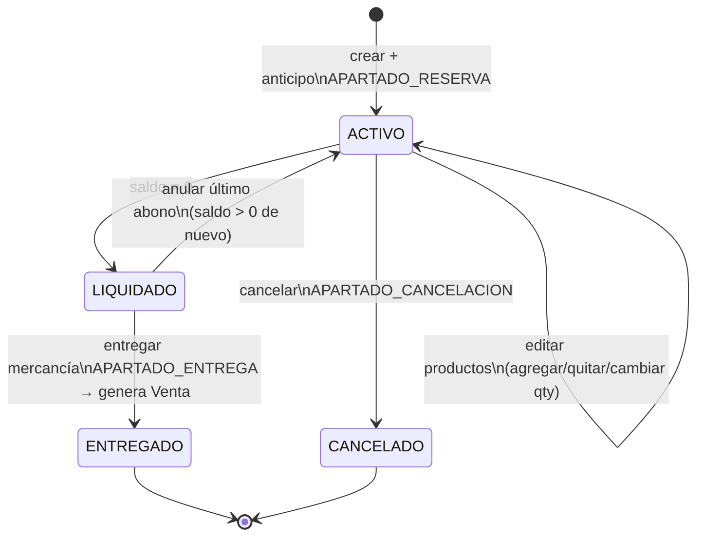
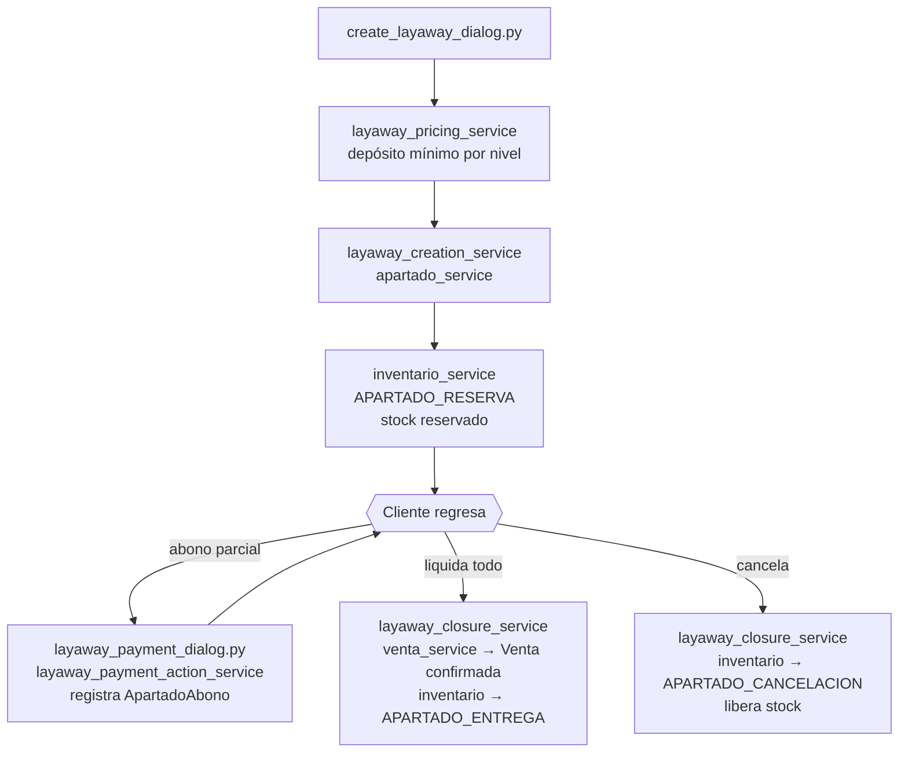

# Servicios — Apartados

**Dominio:** Reservas de mercancía con abonos y entrega posterior
**Cobertura de tests:** 100% ✓
**Archivos:** `services/apartado_service.py` + 8 servicios `layaway_*`

---

## Servicios

### `apartado_service.py` — Core
Crea apartados, registra abonos, entrega y cancela.
- Valida que el operador tenga rol adecuado
- Maneja el estado y el `saldo_pendiente`
- `anular_ultimo_abono()` — elimina el último abono, recalcula totales, revierte LIQUIDADO→ACTIVO si aplica
- `agregar_detalle()` — agrega producto con reserva de inventario, recalcula totales
- `quitar_detalle()` — quita producto, libera inventario, bloquea quitar el último
- `cambiar_cantidad_detalle()` — ajusta cantidad, reserva/libera diferencia
- `_recalcular_totales()` — recalcula subtotal/total/saldo; guarda que total ≥ total_abonado
- Usa: `inventario_service`, `layaway_pricing_service`

### `layaway_creation_service.py`
Flujo operativo de creación desde el diálogo de UI.
- Orquesta la llamada a `apartado_service`

### `layaway_detail_service.py`
Snapshot del detalle del apartado seleccionado para mostrar en UI.

### `layaway_payment_service.py`
Cálculo y validación de pagos parciales.

### `layaway_payment_action_service.py`
Registro operativo de abonos.

### `layaway_closure_service.py`
Entrega, cancelación y edición operativa de apartados.
- `deliver_layaway()` / `settle_and_deliver_layaway()` — entrega con/sin pago final
- `cancel_layaway()` — cancela y libera stock
- `void_last_payment()` — anula último abono
- `add_layaway_item()` / `remove_layaway_item()` / `update_layaway_item_quantity()` — edición de productos
- Usa: `apartado_service`, `venta_service`
- Genera la `Venta` cuando se liquida y entrega

### `layaway_pricing_service.py`
Reglas de precio efectivo, redondeo y anticipo mínimo según nivel del cliente.

### `layaway_alerts_service.py`
Métricas de alertas: apartados vencidos, activos, por vencer.

### `layaway_snapshot_service.py`
Snapshot del listado de apartados para la vista.

### `layaway_receipt_text_service.py`
Genera el texto del recibo de apartado o abono.

---

## Estados de un apartado

## Flujo operativo

---

## Integración con inventario

Cuando se crea un apartado, el inventario registra `APARTADO_RESERVA` — el stock se reserva pero no se descuenta hasta la entrega.

Al entregar, se registra `APARTADO_ENTREGA` que convierte la reserva en salida real.

---

## UI relacionada

- `ui/views/layaway_view.py` — lista de apartados
- `ui/dialogs/create_layaway_dialog.py` — alta con calendario y precios
- `ui/dialogs/layaway_payment_dialog.py` — abonos y liquidación
- `ui/helpers/layaway_*` — 9 helpers de presentación

---

## Ver también
- [[02 - Base de Datos]] — tablas `Apartado`, `ApartadoDetalle`, `ApartadoAbono`
- [[07 - Servicios - Catálogo e Inventario]] — movimientos de inventario
