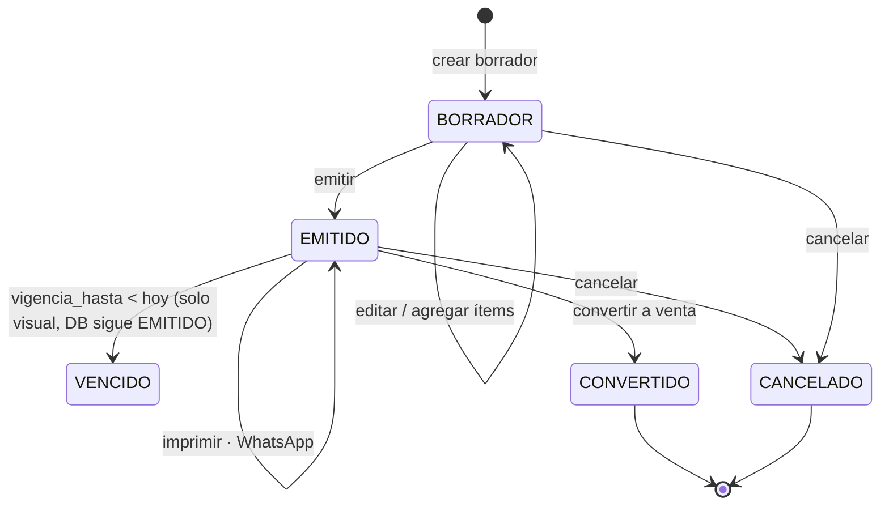
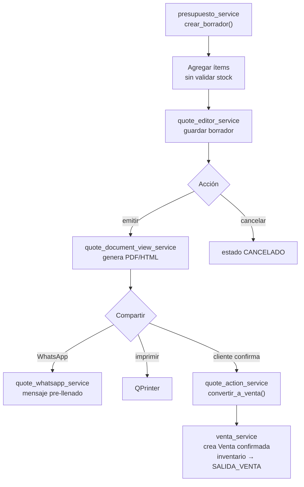

# Servicios — Presupuestos

**Dominio:** Cotizaciones que no afectan inventario
**Cobertura de tests:** ✅ 100% (9/9)
**Archivos:** `services/presupuesto_service.py` + 8 servicios `quote_*`

---

## Regla fundamental

> Los presupuestos **no cobran** y **no descuentan inventario**.
> Son cotizaciones que pueden convertirse a venta, enviarse por WhatsApp o emitirse en papel.

---

## Servicios

### `presupuesto_service.py` — Core
Crea, cancela y consulta presupuestos.
- Estructura similar a `venta_service` pero sin afectar stock

### `quote_action_service.py`
Acciones sobre presupuestos: convertir a venta, cancelar.
- Tests: ✗ (pendiente)

### `quote_editor_service.py`
Guarda y reanuda edición de un presupuesto en borrador.

### `quote_detail_service.py`
Snapshot del detalle del presupuesto seleccionado.

### `quote_snapshot_service.py`
Snapshot del listado de presupuestos para la vista.

### `quote_kiosk_lookup_service.py`
Búsqueda de presupuestos guardados desde el kiosko/satélite.

### `quote_document_view_service.py`
Vistas imprimibles (HTML/Qt) del presupuesto.
- Tests: ✗ (pendiente)

### `quote_text_service.py`
Formato de texto del presupuesto (header, ítems, totales, términos y condiciones).

- Ancho fijo de 38 chars para papel de 80mm
- `DEFAULT_QUOTE_TERMS_LINES` — oraciones completas, `textwrap.wrap` hace el corte de línea automático
- Cada ítem muestra `Talla: X` si la tiene (campo `talla_snapshot`)
- Leyenda `ESTE NO ES UN COMPROBANTE FISCAL NI DE COMPRA` en el encabezado
- Términos actualizados: validez, condiciones de pago, promoción julio 2026 + sistema de apartado

### `offline_quote_storage_service.py`
Almacenamiento local de presupuestos generados sin conexión.

- Archivo: `data/offline_quotes.json` (AppData en Windows)
- `save_offline_quote()` / `list_offline_quotes()` / `get_offline_quote(folio)` / `delete_offline_quote(folio)`
- Los presupuestos locales no se sincronizan automáticamente a la DB

### `ticket_print_settings_cache_service.py`
Cache local de preferencias de impresión del satélite.

- Archivo: `data/ticket_print_settings.json`
- `save_ticket_print_settings(printer, copies)` / `load_ticket_print_settings() → (str, int)`
- El satélite siempre lee este cache primero; la DB es fallback solo si el cache está vacío

### `quote_whatsapp_service.py`
Genera el mensaje de WhatsApp con el resumen del presupuesto.
- Usa: `business_settings_service`, `settings_whatsapp_template_service`

### `quote_client_creation_feedback_service.py`
Feedback al crear un nuevo cliente desde el flujo de presupuesto.

---

## Estados de un presupuesto

> **VENCIDO** es un estado visual calculado en `quote_history_helper._is_quote_expired()`.
> La BD conserva `EMITIDO`. El filtro "Emitidos" excluye vencidos; hay filtro "Vencidos" separado.

---

## Flujo operativo

---

## Diferencia con Venta

| Aspecto | Presupuesto | Venta |
|---------|-------------|-------|
| Afecta inventario | No | Sí |
| Afecta caja | No | Sí |
| Puede enviarse por WhatsApp | Sí | Ticket impreso |
| Puede convertirse | Sí → Venta | N/A |

---

## Reglas de cliente en presupuesto

- El cliente se asigna **solo por escaneo QR** (2026-04-23)
- El combo `quote_client_combo` es de solo lectura (display del cliente asignado)
- El botón "Nuevo cliente" permite crear un cliente rápido y asignarlo
- No hay selección manual desde dropdown

---

## App Satélite y Presupuestos

La [[17 - App Satélite]] está diseñada específicamente para armar presupuestos desde un kiosko. Usa `quote_kiosk_lookup_service` y el flujo de `presupuesto_service` pero sin acceso a Caja ni Inventario.

---

## Ver también
- [[17 - App Satélite]] — kiosko de presupuestos
- [[16 - Flujo de Presupuesto]] — flujo completo con UI
- [[02 - Base de Datos]] — tablas `Presupuesto`, `PresupuestoDetalle`
