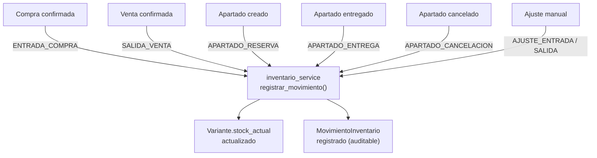

# Servicios — Catálogo e Inventario

> [!success] Desde el 2026-09-14 la venta del kiosko descuenta stock
> `libreta_service.registrar_operacion` (por donde pasan kiosko y POS) llama `descontar_stock`: `SALIDA_VENTA` por venta, `APARTADO_RESERVA` por apartado, nada por abono. Amarrado a `referencia = libreta:N` (no descuenta dos veces), **puede dejar negativo** (un negativo = "esta talla hay que recontarla"), cada talla en un savepoint (un fallo se anota en el log y la venta se guarda igual). Borrar una operación regresa el stock (`CANCELACION_VENTA`). Migración `cd3e4f5a6b7c` quitó el piso de cero a `variante.stock_actual` y `movimiento_inventario.stock_posterior`. Una vez, en el servidor (**lo corre sola la próxima actualización**, paso único de `postactualizacion.py`; salida en `logs\descontar_ventas_pasadas.log`): `descontar_ventas_pasadas --aplicar` resta las ventas de la Libreta posteriores al último conteo de cada talla (vistazo: 774 renglones, 824 piezas, 360 tallas, 143 quedarían en negativo). `EXISTENCIA_CONFIABLE` sigue apagado hasta contar lo que se mueve. Tests: `test_libreta_descuenta_stock`.

> [!info] Cambios de catálogo hechos a mano en producción (2026-09-14)
> - **Práxedis Guerrero** (id 19) → renombrada **Práxedis G Guerrero** (Primaria: 6 prendas, nombres renombrados "…Práxedis G Guerrero"). Nueva **Práxedis Guerrero Secundaria** (id 49) con las 8 prendas de Secundaria movidas (`nivel_educativo_id = 3`), con su stock e historial de tallas. La jornada del 13 (94 tallas, Stayce contó las dos) se partió: jornada 24 → Secundaria (56 tallas), jornada 26 (nueva, mismos datos) → Primaria (38).
> - **Miguel Hidalgo (Rancho Nuevo)** (id 50, nueva): clon de Miguel Hidalgo (id 21) sin chaleco, todo en color **Gris**, stock 0, mismos precios; 6 productos (585–590) / 66 tallas (SKU005376–SKU005441) creados con `CatalogService.crear_producto/crear_variante` (SKUs de la secuencia, auditoría incluida).
> - Los suéteres de Rancho Nuevo (589, 590) **no son grises**: quedaron "Sin color" y sin color en el nombre hasta que Daniel diga cuál.
> - **Pendiente general:** 214 de 322 prendas de escuela están "Sin color" (1,606 tallas, 47 escuelas). Se dieron de alta con prisa; se trabaja después.
> - **Ignacio Allende (Jaral)** (id 51, nueva): clon de Ignacio Allende (id 13) **sin los dos suéteres** (441, 442), mismos colores y precios, stock 0; 7 productos (591–597) / 73 tallas.
> - Receta para partir una escuela: crear `Escuela`, mover `Producto.escuela_id`, renombrar `nombre`/`nombre_base` si llevan la escuela. `nombre_para_hoja` quita el nombre de la escuela del producto en hojas y Revisar, por eso conviene que coincidan.

> [!danger] El stock estuvo congelado del 16 de julio al 14 de septiembre de 2026 (medido 2026-09-10)
> **Vender en el kiosko NO descuenta stock.** El único camino que lo descontaba es `venta_service.registrar_salida_venta`, del POS viejo, muerto desde marzo (6 movimientos `SALIDA_VENTA`, el último el 19/03). El último movimiento de inventario **de cualquier tipo** es del 16 de julio.
>
> `stock_actual` solo lo mueven tres lugares: `conteo_service` (conteo), `inventario_service` (movimiento) y `bodega_service` (salida de caja de bodega).
>
> | Dato | Valor |
> |------|-------|
> | Variantes activas | 4,795 |
> | Nunca contadas | 3,630 (76%) |
> | Vendidas después de su último conteo y aún marcando stock | 122 (220 piezas) |
> | SKUs distintos vendidos (Libreta, 02–10 sep) | 360 |
> | SKUs que hacen el 80% del dinero | 185 (110 nunca contados) |
>
> **Ni el cero ni el número positivo son confiables.** El positivo está inflado porque no baja al vender. El cero puede estar mal si llegó mercancía sin capturarse (última `ENTRADA_COMPRA`: 6 de junio).
>
> Por esto está apagado `EXISTENCIA_CONFIABLE` en [[35 - Demanda No Atendida]].

> [!tip] Recomendación (2026-09-10, en este orden)
> 1. **Que la venta descuente stock**, aplicado al drenar la cola de la Libreta a Postgres: funciona sin red, no bloquea la venta y va amarrado al folio para no descontar doble. Dejar que llegue a negativo — el negativo es la lista de qué recontar. **Hecho el 2026-09-14.**
> 2. **Contar solo lo que se mueve**, no las 4,795. Lista generada: los 185 SKUs del 80% del dinero.
> 3. Recién entonces prender `EXISTENCIA_CONFIABLE = True`.
>
> El conteo ya se puede delegar: gafete, sin pistas, vacío = no contada, jornadas que se pausan y revisión por bloque del dueño. Ver [[36 - Conteos por Jornada]].
>
> No hacer todavía el conteo periódico por escuela: cobra sentido cuando el número se sostenga solo.

## Catálogo

**Cobertura de tests:** ✅ 100% — resuelto 2026-04-14

### `catalog_service.py` — Core
CRUD completo de categorías, marcas, productos y variantes (SKUs).
- Usa: `catalog_audit_service`, `inventario_service`

### `catalog_snapshot_service.py`
Snapshot del listado de catálogo para la vista de Productos.

### `catalog_audit_service.py`
Registra cada cambio en catálogo:
- Tipos: `CREACION`, `ACTUALIZACION`, `ESTADO`, `ELIMINACION`
- Guarda en tabla `CambioCatalogo`

### `catalog_mutation_service.py`
Operaciones puntuales: toggle de estado activo/inactivo, eliminación.
- Tests: ✓ (4 tests — tenía cobertura desde antes)

### `meilisearch_service.py` — Búsqueda typo-tolerant *(agregado 2026-05-20)*
Indexa variantes activas en Meilisearch local. Búsqueda tolerante a errores en 6 áreas del POS.
- Patrón: pre-filtro Meilisearch (limit=500) → filtro local refina con términos exactos
- Fallback automático a búsqueda local si Meilisearch no disponible
- Ver detalles en [[13 - Servicios - Utilidades]]

### `catalog_local_cache_service.py` *(satélite)*
Guarda y lee snapshot del catálogo como JSON local en `data/catalog_cache.json`.
- Permite que el satélite opere sin conexión a la PC principal
- Serializa `Decimal` como string para compatibilidad JSON
- Tests: ✓ 10 tests

---

## Inventario

**Cobertura de tests:** 100% ✓

### `inventario_service.py` — Core
Registra movimientos auditables de inventario.

**Tipos de movimiento:**
| Tipo | Cuándo ocurre |
|------|---------------|
| `ENTRADA_COMPRA` | Se confirma una compra a proveedor |
| `SALIDA_VENTA` | Se confirma una venta |
| `AJUSTE_ENTRADA` | Ajuste manual de entrada |
| `AJUSTE_SALIDA` | Ajuste manual de salida |
| `APARTADO_RESERVA` | Se crea un apartado |
| `APARTADO_ENTREGA` | Se entrega un apartado |
| `APARTADO_CANCELACION` | Se cancela un apartado |

**Regla importante:** No permite stock negativo, excepto si `sale_stock_policy.allow_negative_sale_stock()` está habilitado.

### `inventory_count_service.py`
Conteo fisico rapido — V1 y V2 (legacy, desde dialogo de inventario).
- V2: puede iniciarse desde seleccion multiple en Inventario
- Modo "uno a uno" explicito
- Boton rapido "Restar 1"
- El payload incluye `all_variante_ids` (todos los SKUs escaneados, con y sin delta) para que `ultimo_conteo_at` se actualice aunque el stock no cambie

### `conteo_service.py` *(nuevo 2026-05-26, auditado 2026-05-29)*
Conteo fisico avanzado — integrado al Panel de Uniformes via QWebChannel.
- **Registro**: `registrar_conteo()` / `registrar_conteos_lote()` — crea registro en `conteo_inventario`, actualiza `variante.ultimo_conteo_at`, NO ajusta stock
- **Ajuste**: `confirmar_ajustes_lote()` — aplica diferencias creando `MovimientoInventario` por cada ajuste (AJUSTE_ENTRADA o AJUSTE_SALIDA). Refresca inventario en tabla principal.
- **Consultas**: `obtener_variantes_para_conteo(escuela_id, nivel_id)`, `obtener_conteos_pendientes()`, `obtener_historial_conteos()` (con joinedload producto), `obtener_estado_conteo_escuela(escuela_id, nivel_id)`
- **Agrupadas**: `obtener_variantes_agrupadas_por_producto()` — agrupa por producto, ordena por PIEZA_ORDER, excluye virtuales
- **Config**: `guardar_config_conteo()` — upsert dias_vigencia por escuela (default 90)
- Usa `with_for_update()` para row locks (sin joinedload — incompatible en PostgreSQL)
- Soporte multinivel: filtra por `nivel_educativo_id` cuando se provee

### `conteo_sheet_service.py` *(nuevo 2026-05-29)*
Genera hojas de conteo pre-llenadas para impresora termica (80mm).
- Una hoja por producto, solo tallas existentes, numeradas "HOJA DE CONTEO X/N"
- Excluye productos virtuales (Pants 3pz, Chamarra)
- Nombres limpiados (sin escuela, sin "Ad hoc", sin pipes)
- Columnas: Talla | Exist. (vacio) | Pedido (vacio) — la empleada llena a mano
- Soporte nivel_id para escuelas multinivel

### `inventory_label_service.py`
Carga y render de etiquetas para impresión.
- Integración con Brother QL-800 en Windows
- `render_inventory_label_from_cache_row(row)` — renderiza desde cache sin DB (modo offline del satélite)

### `inventory_overview_service.py`
Snapshot de ficha rápida de un SKU/variante.

### `inventory_snapshot_service.py`
Snapshot del listado de inventario para la vista.
- Usa: `search_filter_service`

---

## Flujo de movimiento de inventario



---

## Etiquetas en Windows

La impresión de etiquetas en Windows requiere:
- `win32print`, `win32ui` y `PIL.ImageWin`
- Driver oficial de Brother QL-800
- No debe mandarse a "Microsoft Print to PDF"

Ver documento: `docs/etiquetas_windows.md`

---

## Modelo de datos relevante

```
Producto (nombre_base)
  └─ Variante (SKU, talla, color, precio, stock_actual, stock_minimo, ultimo_conteo_at)
        └─ MovimientoInventario (tipo, cantidad, usuario, fecha)
```

- `stock_minimo` (nullable int) — mínimo aceptable por presentación; activa tono `warning` y texto "Bajo mín" en inventario cuando `stock_actual < stock_minimo`
- `ultimo_conteo_at` (nullable datetime TZ) — última vez que el SKU fue escaneado en un conteo físico; se muestra como "Hoy / Ayer / Hace Nd / Nunca" en la tabla de inventario

---

## Bodega (mini-WMS) — agregado 2026-05-18, refactorizado 2026-05-28

> `stock_actual` sigue siendo el total global. Bodega rastrea distribución física.

### Modelo de stock por ubicación *(refactor 2026-05-28)*
- **`stock_actual`** = total global (ventas, compras, apartados lo modifican)
- **`stock_piso`** = derivado: `SUM(bodega_contenido.cantidad)` donde `rack = 'PISO'`
- **`stock_bodega`** = derivado: `SUM(bodega_contenido.cantidad)` donde `rack != 'PISO'`
- **`stock_tienda`** = `stock_actual - stock_piso - stock_bodega` (en estantes, disponible para venta)
- Los tres son `@property` en `Variante`, NO columnas almacenadas
- Relación `Variante.bodega_contenidos` con `lazy="noload"` — requiere `joinedload` explícito
- `inventory_snapshot_service.py` usa subqueries SQL correlacionadas para rendimiento
- `generar_panel_uniformes.py` usa CTE `bodega_stock` para los mismos cálculos en raw SQL

**Ubicaciones fijas:** PISO-N1, PISO-N2 y ALMACEN-N1. Script `migrar_codigos_bodega.py` crea ALMACEN-N1 si no existe.

### `bodega_service.py` — Service layer
Patrón: clase con `@staticmethod`, `Session` inyectado (igual que `InventarioService`).

**Ubicaciones:** `listar_ubicaciones` (solo lectura, PISO/ALMACÉN fijos), `_abrev_ubicacion` (PISO N1→P1)
**Cajas:** `crear_caja`, `mover_caja`, `cambiar_estado_caja`, `listar_cajas`, `obtener_caja_detalle`
**Nomenclatura *(refactor 2026-05-31)*:** código = `{CAT}-{UBIC}-{SEQ}` (ej: `A-P1-001`)
  - `_siguiente_codigo(session, categoria, ubicacion)` genera secuencia por categoría+ubicación
  - `_regenerar_codigo(session, caja)` actualiza código + QR al reclasificar o mover
  - `reclasificar_caja()` y `mover_caja()` llaman `_regenerar_codigo()` automáticamente
**Contenido:** `ingresar_producto` (valida stock), `retirar_producto`, `transferir_producto`, `ingreso_masivo`
**Reclasificar/Mover:** `reclasificar_caja` (cambia categoría + regenera código), `mover_caja` (cambia ubicación + regenera código)
**Búsqueda:** `buscar_variante_en_bodega`, `buscar_por_texto`, `buscar_por_texto_agrupado`
**Estadísticas:** `total_prendas_en_bodega`, `total_cajas_activas`, `stock_disponible_tienda`
**Historial:** `historial_caja`
**QR:** `generar_qr_data`

**Constraint clave (en servicio, no en DB):** `sum(bodega_contenido.cantidad) <= variante.stock_actual`

**Refresco de inventario:** toda operación de bodega (mover, agregar, retirar) invalida el snapshot cache y refresca la tabla de inventario vía `_notify_inventory_changed()`.

**Tests:** 15 en `test_bodega_service.py` (SQLite in-memory)

---

## UI relacionada

- `ui/views/products_view.py` — catálogo con filtros
- `ui/views/inventory_view.py` — inventario con columnas Stock (tienda), Piso, Almacén
- `ui/views/bodega_view.py` — bodega: cajas, ubicaciones, búsqueda, historial
- `ui/dialogs/catalog_product_dialog.py` — alta/edición de producto (1,852 líneas)
- `ui/dialogs/catalog_variant_dialog.py` — alta/edición de variantes
- `ui/dialogs/inventory_count_dialog.py` — conteo físico (662 líneas)
- `ui/dialogs/inventory_label_dialog.py` — etiqueta individual
- `ui/dialogs/inventory_label_batch_dialog.py` — lote de etiquetas
- `ui/dialogs/bodega_ingreso_dialog.py` — ingreso masivo con matriz de tallas
- `ui/dialogs/bodega_ubicaciones_dialog.py` — vista solo lectura de PISO y ALMACÉN
- `ui/dialogs/quick_kiosk_dialog.py` — consulta rápida de precios (Ctrl+K)
- `services/pedido_sheet_service.py` — hojas de pedido térmicas + texto WhatsApp

---

## Ver también
- [[02 - Base de Datos]] — tablas `Producto`, `Variante`, `MovimientoInventario`, `BodegaCaja`, `BodegaContenido`
- [[17 - App Satélite]] — uso de `catalog_local_cache_service` en modo offline
- [[19 - Deuda Técnica]] — `catalog_product_dialog` con demasiada lógica interna

> [!info] Cambios directos en producción (2026-09-20)
> `Mandil Infantil Estampado` (id 584, SKU005375, $75, alta del 13/09) → **Bata Infantil Estampado** (nombre y nombre_base). Las 8 *Bata Infantil* de siempre (ids 51–58) no se tocaron.

## Rediseño del catálogo (2026-09-20)

> [!info] Fase 1 — nombres limpios (hecha, aplicada en producción)
> - `Producto.nombre` = solo el nombre ("Camisa Cuello Olan Blanca"); tipo de prenda y de pieza en sus campos. `Producto.nombre_completo` → "Camisa Cuello Olan Blanca · Oficial · Camisa". Los tickets ya usaban `build_ticket_product_name` (nombre_base + escuela).
> - `scripts/limpiar_nombres_productos.py [--aplicar]`: `nombre_limpio()` (nombre_base curado > primer tramo), `con_mayusculas()` (inicial mayúscula salvo conectores; siglas y "2pz" intactos), `con_su_escuela()` (Vicente Guerrero → Vicente Guerrero Preescolar), recupera tipos del sufijo, choques → " (n)" (activos primero; inactivos ceden sin aviso). Aplicación en dos pasadas (nombre temporal) por el UNIQUE marca+nombre.
> - `scripts/separar_escuela_por_nivel.py --escuela ID --nivel N --nombre "…" [--renombrar-vieja] [--aplicar]`: mueve los productos de ese nivel (SKUs intactos), copia ligas y `ConfigConteoEscuela`, y parte las jornadas que traían tallas de los dos planteles.
> - `scripts/fundir_productos.py --de B --en A [--aplicar]`: tallas de B al destino con su SKU; talla repetida → existencia a la de A (movimientos `fundido:N`) y queda inactiva bajo B (talla+color únicos por producto); B inactivo con "[fundido en #A]".
> - Tests: `test_limpiar_nombres_productos`, `test_separar_escuela_por_nivel`, `test_fundir_productos`.
>
> **Fase 2 — el uniforme como entidad** (base hecha 2026-09-21, ver [[38 - Catálogo Fase 2 - Uniformes]]): `uniforme` + `uniforme_pieza` (grupo, orden, obligatoria, color) señalando productos propios o generales; `services/uniforme_service.py`, `scripts/armar_uniformes.py`, POS Más → Uniformes por escuela. Falta 2b: que hoja, mapa, tarifario y guiado lean del uniforme y retirar las ligas. **Fase 3 — conjuntos** (hecha 21/09, ver la 38 §5b): Pants 3pz y Chamarra son **artificiales** con receta (`conjunto_componente`, `conjunto_service`) — venderlos mueve sus piezas y su stock se calcula (`derivado:`); `scripts/armar_recetas.py` y "Se arma de" en Uniformes por escuela. Pendiente en producción.

## La Licra tiene su tipo de pieza (2026-09-22)

El mapa de conteos pintaba un mosaico **"Sin tipo"** que desentonaba: era la **Licra** (#516, general, 15 tallas), el único producto activo sin `tipo_pieza`. Migración `5a6b7c8d9e0f`: crea el tipo *Licra* si falta y se lo pone a los productos que se llaman así y no tienen tipo (nada más se toca). En la hoja y en el tarifario va **junto a la Malla** (`_PIEZA_ORDER`). Ya no queda ningún producto activo sin tipo.

> Ojo para el conteo: esa Licra trae **stock −11** (de descontar las ventas viejas): se vendieron 11 más de las que el sistema creía. Se corrige contándola.
