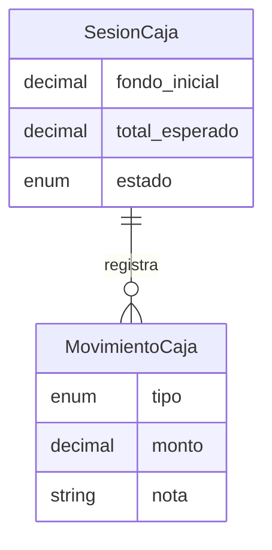
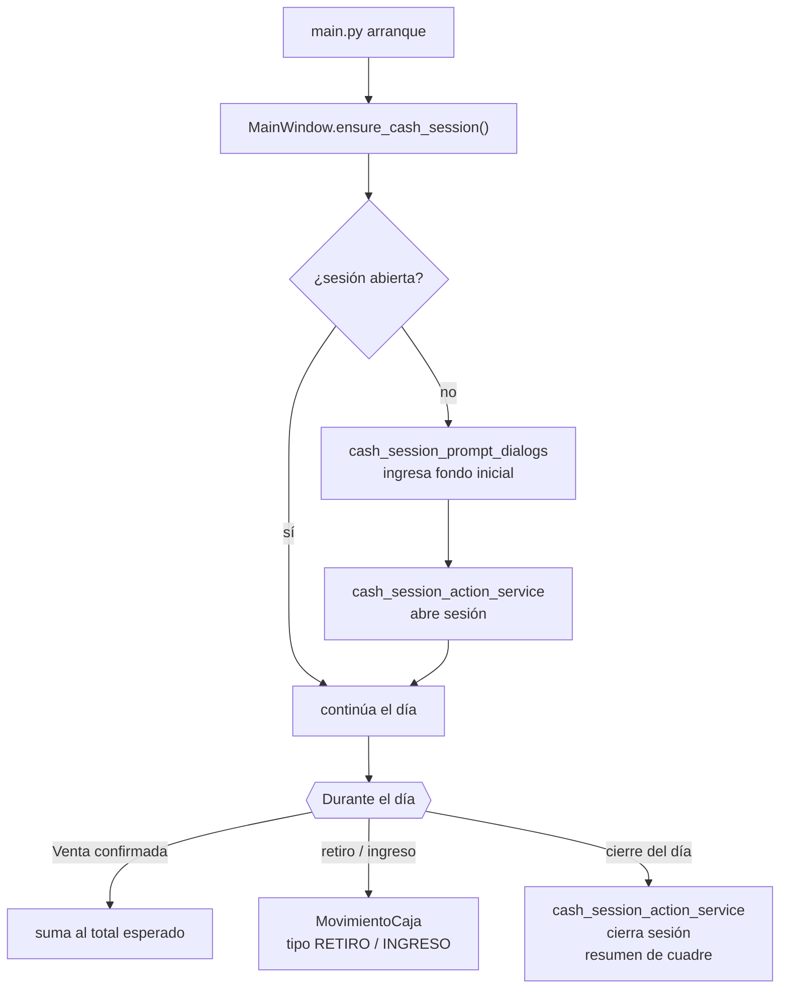

# Servicios — Caja

**Dominio:** Sesiones de caja, movimientos de efectivo, apertura y cierre
**Cobertura de tests:** 100% ✓

---

> [!info] No confundir (2026-09-08)
> `caja_service.py` = caja del **POS principal** (SesionCaja/MovimientoCaja). La caja del **kiosko/Libreta** (reactivo, corte por periodo, retiros) es `corte_caja_service.py` + `retiros_service.py`, independiente. Ver [[33 - Caja, Nómina y Corte Automático]].

> [!warning] La caja del POS quedó fuera de la interfaz (2026-09-10)
> La pestaña **Caja** está oculta ([[03 - Mapa de Módulos UI]]) y con ella se apagó todo lo que la acompañaba: el aviso "Caja pendiente de corte" al abrir, el bloqueo para operar, la etiqueta del encabezado, el botón Corte, el recordatorio de las 5 de la tarde y la consulta que lo alimentaba cada minuto en el hilo de la UI. Interruptor: `caja_en_el_pos()` en `ui/main_window.py`.
>
> **Por qué molestaba:** en producción quedó la sesión `id=18` abierta el **1 de junio** que nunca se cerró, así que cada arranque saludaba con el aviso. La sesión **no se borró**, sigue ahí.
>
> El servicio y sus tablas siguen intactos. El corte de verdad se hace desde el kiosko: `corte_caja_service.py`.

## Servicios

### `caja_service.py` — Core
Abre y cierra sesiones de caja, resume movimientos.
- Valida que no haya sesión abierta al abrir nueva
- Calcula totales esperados al cierre
- `ResumenCaja` incluye `total_descuentos` (suma de `venta.descuento_monto`) y `total_ajuste_redondeo` (leído de `observacion`) para separar descuento de redondeo en el detalle del corte

### `cash_session_action_service.py`
Acciones operativas de la sesión activa:
- Apertura con fondo inicial
- Registro de movimientos (ingreso / retiro / reactivo)
- Cierre con cuadre
- `CashSessionGateSnapshot` incluye `elapsed_minutes` para mostrar tiempo transcurrido en diálogo de reanudación

### `cash_session_history_service.py`
Snapshots del historial de sesiones para la vista.

---

## Modelo de datos

---

## Flujo de sesión

---

## Relación con Ventas

Cada `Venta` confirmada está asociada a una `SesionCaja` activa. No se puede confirmar una venta sin sesión de caja abierta.

---

## UI relacionada

- `ui/views/cashier_view.py` — tab de Caja
- `ui/dialogs/cash_session_prompt_dialogs.py` — prompts de apertura/cierre
- `ui/helpers/cash_session_feedback_helper.py` — mensajes HTML para diálogo de reanudación (pill de estado, tiempo transcurrido, tabla info) y confirmaciones de movimientos/corte
- Header status label — HTML con colores: verde "Caja abierta" + reactivo, rojo "Caja cerrada" o "Corte pendiente"

---

## Ver también
- [[04 - Servicios - Ventas]] — ventas que ocurren dentro de la sesión
- [[02 - Base de Datos]] — tablas `SesionCaja`, `MovimientoCaja`
