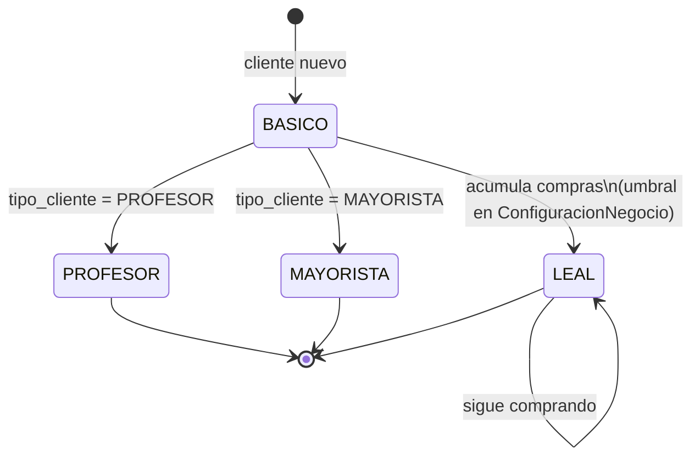
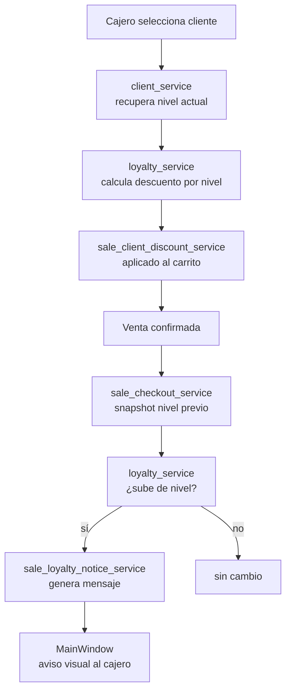

# Servicios — Clientes y Lealtad

**Cobertura de tests:** ⚠️ `loyalty_service` sin tests — **CRÍTICO**

---

## Servicios de Clientes

### `client_service.py`
CRUD de clientes, búsqueda, asignación de nivel.
- Usa: `loyalty_service`
- Tests: ✓

### `customer_card_service.py`
Renderiza la credencial visual del cliente (tarjeta QR + foto).
- Usa: `loyalty_service`, `business_settings_service`
- Tests: ✗ (pendiente)

---

## Servicios de Lealtad

### `loyalty_service.py` — Core ⚠️
Reglas de niveles de lealtad, descuentos y cálculo de elegibilidad.
- Define specs visuales: colores, labels por nivel
- Usa: `business_settings_service`
- Tests: ✗ **CRÍTICO — Es el núcleo de los beneficios del cliente**

---

## Niveles de lealtad

| Nivel | Tipo cliente | Características |
|-------|-------------|----------------|
| `BASICO` | GENERAL | Sin descuento preferente |
| `LEAL` | GENERAL | Acumula compras, descuento por volumen |
| `PROFESOR` | PROFESOR | Descuento especial |
| `MAYORISTA` | MAYORISTA | Precio mayorista |

Los umbrales exactos se configuran en `ConfiguracionNegocio`.

---

## Flujo de lealtad en una venta

---

## Credencial de cliente

El `customer_card_service` genera una imagen con:
- QR del cliente (para escanear en caja)
- Nombre del cliente
- Nivel de lealtad con color
- Logo del negocio (de `business_settings_service`)

---

## Campos del modelo `Cliente`

| Campo | Descripción |
|-------|-------------|
| `nombre` | Nombre completo |
| `telefono` | Teléfono (usado para WhatsApp) |
| `nivel_lealtad` | BASICO / LEAL / PROFESOR / MAYORISTA |
| `tipo_cliente` | GENERAL / PROFESOR / MAYORISTA |
| `descuento_preferente` | Descuento fijo asignado manualmente |
| `nivel_asignado_por_user_id` | Quién asignó el nivel |
| `card_image_path` | Ruta a la imagen de credencial generada |

---

## Ver también
- [[04 - Servicios - Ventas]] — cómo se aplican los descuentos por lealtad
- [[11 - Servicios - Configuración y Marketing]] — configuración de umbrales de lealtad
- [[18 - Cobertura de Tests]] — `loyalty_service` sin tests
- [[19 - Deuda Técnica]] — prioridad de agregar tests a `loyalty_service`
