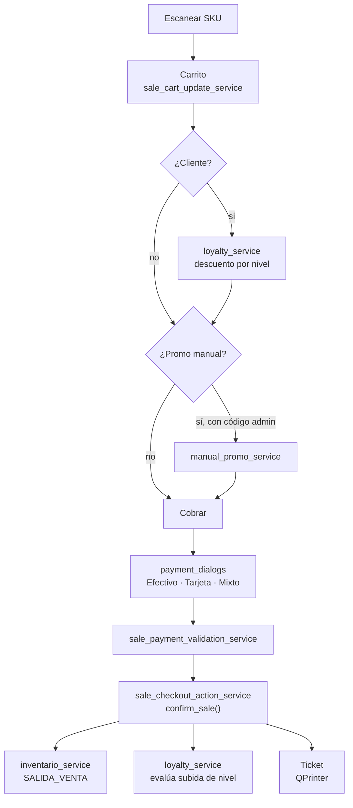

# Flujo de Venta

## Pasos operativos

### 1. Abrir caja (inicio del día)
```
main.py → MainWindow.ensure_cash_session()
  └─ Si no hay sesión abierta → cash_session_prompt_dialogs
  └─ Cajero ingresa fondo inicial
  └─ cash_session_action_service.abrir_sesion()
```

### 2. Escanear ítems
```
cashier_view.py → campo de SKU
  └─ MainWindow._handle_add_sale_item()
  └─ catalog_service → busca variante por SKU
  └─ inventario_service → verifica stock (según sale_stock_policy)
  └─ carrito se actualiza en pantalla
  └─ sale_cart_update_service → gestiona líneas
```

### 3. Seleccionar cliente (opcional)
```
Cajero busca o escanea QR del cliente
  └─ sale_selected_client_service → lookup
  └─ scanned_client_flow_service → si viene de QR
  └─ loyalty_service → calcula descuento por nivel
  └─ sale_discount_lock_service → bloquea si ya hay descuento manual
  └─ UI actualiza descuento visible en carrito
```

### 4. Aplicar promo manual (opcional, requiere autorización)
```
Cajero solicita promoción manual
  └─ manual_promo_service → cajero pide código al admin
  └─ admin ingresa código → manual_promo_flow_service verifica hash
  └─ sale_discount_context_service → aplica porcentaje manual
  └─ AutorizacionPromocionManual se guarda en BD (auditoría)
```

### 5. Registrar forma de pago
```
Cajero presiona "Cobrar"
  └─ payment_dialogs.py → calculadora de cambio
  └─ sale_payment_collection_service → Efectivo / Tarjeta / Transferencia / Mixto
  └─ sale_payment_validation_service → verifica que el monto cubre el total
  └─ sale_rounding_service → calcula cambio redondeado
```

### 6. Confirmar la venta
```
sale_checkout_service → snapshot pre-confirmación (nivel cliente actual)
  └─ sale_checkout_action_service.confirm_sale()
        └─ venta_service.confirmar_borrador()
        └─ inventario_service.registrar_movimiento(SALIDA_VENTA)
        └─ loyalty_service → evalúa si el cliente sube de nivel
        └─ sale_loyalty_notice_service → genera mensaje si hay cambio
```

### 7. Imprimir ticket
```
sale_ticket_totals_service → calcula totales finales
  └─ sale_ticket_text_service → genera texto de header/footer
  └─ sale_document_service → arma documento completo
  └─ sale_document_view_service → render Qt/HTML
  └─ QPrinter → imprime
```

---

## Diagrama del flujo completo



---

## Casos especiales

### Venta sin código (`SIN-CODIGO`)
- Popup mínimo con precio obligatorio y nombre rápido opcional
- Entra como `SIN-CODIGO` / `Venta manual`
- No toca inventario
- Estado: `validated-tests` — pendiente validación manual

### Venta con cliente escaneado
- El QR del cliente contiene su ID
- `scanned_client_flow_service` resuelve el cliente y aplica beneficios automáticamente

### Pago mixto
- El cajero puede dividir entre Efectivo + Tarjeta + Transferencia
- `sale_payment_collection_service` agrupa las formas de pago
- El ticket muestra el desglose

---

## Ver también
- [[04 - Servicios - Ventas]] — detalle de cada servicio
- [[08 - Servicios - Caja]] — sesión donde ocurre la venta
- [[09 - Servicios - Clientes y Lealtad]] — descuentos y niveles
