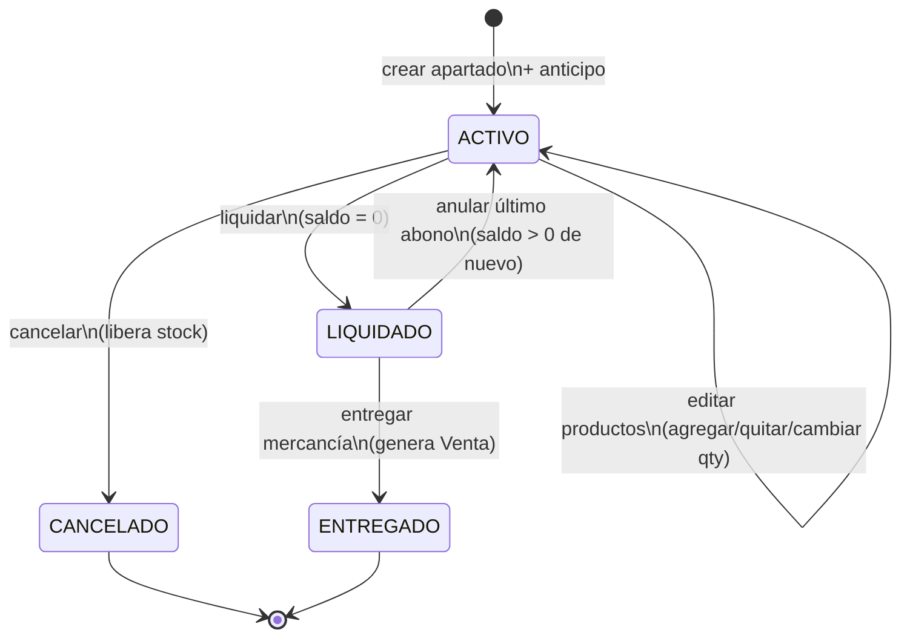

# Flujo de Apartado

## ¿Qué es un apartado?

Una reserva de mercancía con anticipo. El cliente paga una parte y regresa después a liquidar y recoger. El inventario queda reservado desde la creación del apartado.

---

## Flujo completo

### 1. Crear apartado
```
Cajero abre "Nuevo Apartado"
  └─ create_layaway_dialog.py
        ├─ Seleccionar cliente (obligatorio)
        ├─ Agregar ítems (SKU + cantidad)
        ├─ layaway_pricing_service → calcula precio efectivo por nivel cliente
        ├─ layaway_pricing_service → calcula depósito mínimo
        ├─ Cajero registra primer pago (anticipo)
        └─ layaway_creation_service.create_layaway()
              └─ apartado_service.crear_apartado()
              └─ inventario_service.registrar_movimiento(APARTADO_RESERVA)
              └─ ApartadoAbono se crea con el anticipo
```

### 2. Registrar abono
```
Cliente regresa a abonar
  └─ layaway_view.py → selecciona apartado activo
  └─ layaway_payment_dialog.py → calculadora de abono
  └─ layaway_payment_service → valida que el monto sea válido
  └─ layaway_payment_action_service → registra ApartadoAbono
  └─ saldo_pendiente se reduce
```

### 3. Entregar (liquidar)
```
Cliente paga el saldo restante y recoge
  └─ layaway_payment_dialog.py → "Liquidar y entregar"
  └─ layaway_closure_service.entregar()
        └─ apartado_service → estado → LIQUIDADO → ENTREGADO
        └─ venta_service → genera Venta confirmada
        └─ inventario_service.registrar_movimiento(APARTADO_ENTREGA)
              (convierte la reserva en salida real)
```

### 4. Anular último abono
```
Cajero selecciona apartado → "Anular abono"
  └─ Confirma con diálogo de seguridad
  └─ layaway_closure_service.void_last_payment()
        └─ apartado_service.anular_ultimo_abono()
              ├─ Elimina el último ApartadoAbono
              ├─ Recalcula total_abonado y saldo_pendiente
              └─ Si estaba LIQUIDADO y saldo > 0 → revierte a ACTIVO
```

### 5. Editar apartado (solo ACTIVO)
```
Cajero selecciona apartado activo → "Editar apartado"
  └─ Diálogo con tabla de productos y botones:
        ├─ "Agregar producto" → SKU + cantidad
        │     └─ add_layaway_item() → apartado_service.agregar_detalle()
        │           └─ inventario_service(APARTADO_RESERVA)
        ├─ "Quitar seleccionado" → elimina línea (no la última)
        │     └─ remove_layaway_item() → apartado_service.quitar_detalle()
        │           └─ inventario_service(APARTADO_LIBERACION)
        └─ "Cambiar cantidad" → nueva qty
              └─ update_layaway_item_quantity() → apartado_service.cambiar_cantidad_detalle()
                    └─ Reserva o libera la diferencia
  └─ _recalcular_totales() al final de cada operación
        └─ Guarda que nuevo total ≥ total_abonado
```

### 6. Cancelar (opcional)
```
layaway_closure_service.cancelar()
  └─ apartado_service → estado → CANCELADO
  └─ inventario_service.registrar_movimiento(APARTADO_CANCELACION)
        (libera el stock reservado)
```

---

## Estados y transiciones



---

## Reglas de negocio

- El **depósito mínimo** lo calcula `layaway_pricing_service` según el nivel del cliente
- No se puede entregar sin que el saldo sea cero
- Al cancelar, el stock reservado se libera inmediatamente
- Al entregar, se genera automáticamente una `Venta` confirmada (para trazabilidad y analítica)
- **No hay devoluciones de dinero** — política de negocio, no es bug
- Solo se puede anular el **último** abono registrado
- Al editar, el nuevo total no puede ser menor al total ya abonado
- No se puede quitar el último producto de un apartado (hay que cancelarlo)
- Solo apartados **ACTIVO** son editables

---

## Alertas de apartados

`layaway_alerts_service` monitorea:
- Apartados **vencidos** (pasaron la fecha acordada)
- Apartados **por vencer** (próximos 7 días)
- Total de monto pendiente

---

## UI relacionada

- `ui/views/layaway_view.py` — lista de apartados activos, botones de acción
- `ui/dialogs/create_layaway_dialog.py` — alta con calendario y botones rápidos de vencimiento
- `ui/dialogs/layaway_payment_dialog.py` — abonos con calculadora tipo Caja
- `ui/helpers/layaway_action_helper.py` — habilita/deshabilita botones según permisos y estado
- `ui/main_window.py` — handlers `_handle_void_layaway_payment()` y `_handle_edit_layaway()`

---

## Ver también
- [[05 - Servicios - Apartados]] — detalle de cada servicio
- [[07 - Servicios - Catálogo e Inventario]] — movimientos de inventario del apartado
- [[02 - Base de Datos]] — tablas `Apartado`, `ApartadoDetalle`, `ApartadoAbono`
