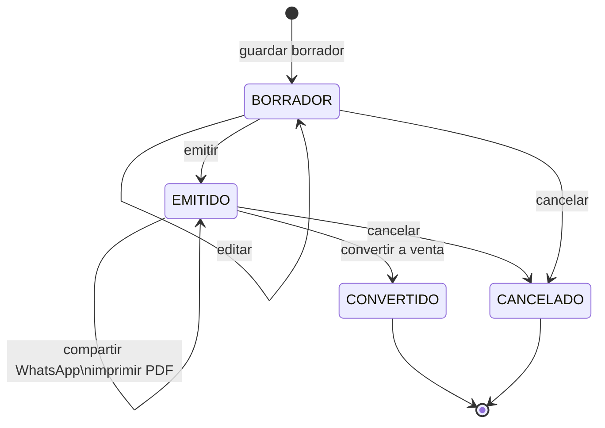

# Flujo de Presupuesto

## ¿Qué es un presupuesto?

Una cotización. No cobra, no descuenta inventario. Puede imprimirse, enviarse por WhatsApp o convertirse en venta cuando el cliente confirma.

---

## Flujo desde el POS Principal

### 1. Crear borrador
```
Tab de Presupuestos → "Nuevo presupuesto"
  └─ presupuesto_service.crear_borrador()
  └─ Agregar ítems (sin validar stock)
  └─ Seleccionar cliente (opcional)
  └─ quote_editor_service → guarda borrador
```

### 2. Emitir
```
Cajero presiona "Emitir"
  └─ presupuesto_service → estado: BORRADOR → EMITIDO
  └─ quote_document_view_service → genera PDF/HTML
  └─ Impresión opcional (QPrinter)
```

### 3. Enviar por WhatsApp
```
Cajero presiona "WhatsApp"
  └─ quote_whatsapp_service → formatea mensaje con totales
  └─ business_settings_service → obtiene templates configurados
  └─ Se abre WhatsApp con mensaje pre-llenado
```

### 4. Convertir a venta (cliente confirma)
```
quote_action_service.convertir_a_venta()
  └─ presupuesto_service → estado: CONVERTIDO
  └─ venta_service.crear_borrador() → crea venta con los mismos ítems
  └─ Cajero va a Caja para cobrar
```

### 5. Cancelar
```
presupuesto_service → estado: CANCELADO
(sin efecto en inventario)
```

---

## Flujo desde la App Satélite

Ver [[17 - App Satélite]] para el flujo completo desde el kiosko.

Diferencias vs POS principal:
- No hay tab de Caja ni Inventario
- Interfaz simplificada para pantalla táctil
- Siempre conectado a la BD de la PC principal

---

## Estados



---

## Ver también
- [[06 - Servicios - Presupuestos]] — detalle de servicios
- [[17 - App Satélite]] — kiosko de presupuestos
- [[02 - Base de Datos]] — tablas `Presupuesto`, `PresupuestoDetalle`
