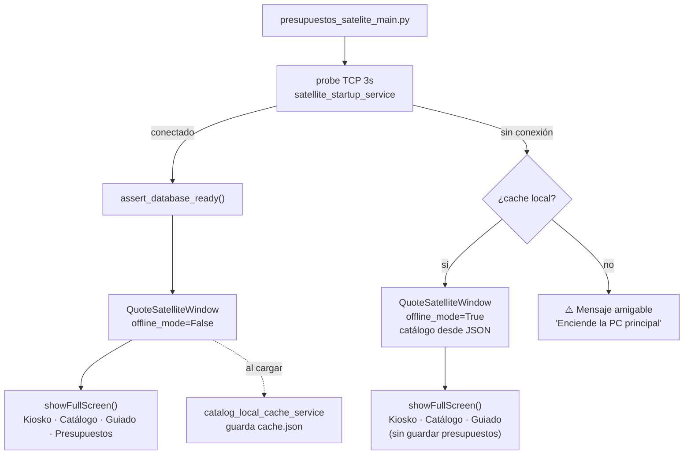
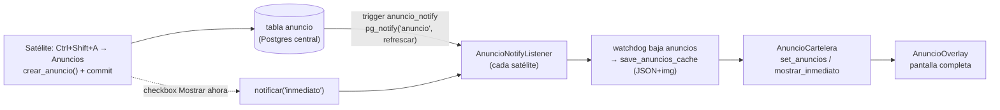

# App Satélite de Presupuestos

> [!important] Menú del kiosko (2026-09-10)
> Se fue el botón **Cámaras** (el visor sigue en Ctrl+Shift+C) y entró **Conteos**. **Calendario** quedó solo con el calendario del mes. Orden: Kiosko · Venta rápida · Presupuesto guiado · Libreta · Calendario · Conteos. Sigue el patrón de ocultar con `setVisible(False)` y comentario; nada se borra. Ver [[36 - Conteos por Jornada]].

> [!success] Cambios 2026-09 (rama `chore/reorganizacion-repo`, EN PISO) — ver [[28 - Libreta Digital]] y [[29 - Updates y Mensajería]]
> - **Libreta digital:** registro automático de ventas/apartados/abonos por gafete, comisiones (3pz=2), pago con tarjeta (4.5% neto), corte EN CAJA imprimible, meta semanal, borrado por el dueño. Sustituye la libreta física y el ticket doble.
> - **Venta rápida:** copia de ticket OPCIONAL (el propio gafete la confirma), pregunta de pago tarjeta/efectivo, botón Abono, gafete releído ignorado, guard anti-Enter del escáner en diálogos de impresión.
> - **Sidebar:** "Tarifarios" y "Enviar a preparar" ocultos (código vivo; una línea los restaura). Libreta toma el lugar de Tarifarios.
> - **Arranque cache-first:** online pinta el catálogo desde `catalog_cache.json` (~35ms) y el watchdog trae lo fresco en background (repintando). Reindex Meilisearch ya no bloquea la UI.
> - **Auto-update por red:** los kioskos se actualizan solos desde `\\192.168.0.10\pos_updates` al abrir el lanzador. Bundle incluye su `.env` y pywin32 (impresión).
> - **Perf/regresión:** statement_timeout 30s, probe antes del timer de chequeos, debounce en búsquedas de Settings, batch de actividad de empleadas, 10 fixes de code-review.

> [!info] Cambios recientes (2026-07, rama `feat/despachador-satelite`) — ver [[21 - Historial de Sesiones]]
> - **Rol de impresión por PC:** 🖨 Servidor de impresión (tiene las impresoras, drena la cola) vs 📡 Estación (solo encola, NO configura impresoras). El despachador solo corre en el Servidor. Ver `docs/arquitectura_impresion.md`.
> - **Impresión ESC/POS crudo** para hojas de conteo (spooler RAW, sin driver); tickets siguen con su render histórico. Codepage configurable en el admin.
> - **Calendario:** productos básicos como entidad, filtro por tipo, días sin contar, y **recordatorios** (pagos/descansos/notas) con chips + banner de próximos. Botón "Subir conteo".
> - **Navegación** de secciones con **Ctrl+← / Ctrl+→**.
> - **Perf:** calendario 12× más rápido (se eliminó un N+1 que congelaba la UI ~9 s).
> - **Fluidez con servidor apagado (2026-07-18):** el despachador ya no pollea PostgreSQL en el hilo de UI cuando la PC principal está apagada → el satélite va fluido en el tramo en que las empleadas lo encienden (9–9:30) antes de que llegue el servidor (~11). Ver Roadmap → *Fluidez con servidor apagado*.
> - **Anuncios / Cartelera (2026-07-18):** difunde texto o imágenes a los satélites (broadcast por la DB central + LISTEN/NOTIFY). Cartelera a pantalla completa cuando el satélite está inactivo (2 min) + aviso inmediato. **Dirigible:** cada satélite tiene nombre + presencia (🟢/⚪) y puedes elegir en cuáles se muestra (default: todos). Se crea desde el propio satélite en `Ctrl+Shift+A → 📣 Anuncios`. Ver sección *Anuncios / Cartelera* abajo. ⚠️ Requiere `alembic upgrade head` en la PC principal.

## ¿Qué es?

Un kiosko independiente que corre en una segunda computadora. Sirve para que clientes o empleadas consulten precios y armen presupuestos **sin necesidad de acceso al POS principal**.

---

## Límites claros

| Puede hacer | No puede hacer |
|-------------|----------------|
| Consultar catálogo y precios | Cobrar |
| Armar presupuestos | Descontar inventario |
| Emitir presupuesto | Abrir caja |
| Enviar por WhatsApp | Acceder a configuración sensible |
| Buscar clientes | Confirmar ventas |
| Navegar catálogo en modo local | — |
| Guardar presupuestos localmente (offline) | — |
| Buscar y compartir presupuestos locales | — |
| Imprimir tickets de venta/apartado (Venta Rápida) | Registrar la venta en DB |

> **No es una segunda caja.** No reemplaza al POS principal. Venta Rápida solo imprime tickets — no descuenta inventario ni registra ventas.

---

## Arquitectura



### Páginas del satélite (QStackedWidget en `quote_satellite_window.py`, ~6,170 líneas)

| # | Página | Qué hace |
|---|--------|----------|
| 0 | Kiosko | Consulta por escaneo de SKU + histórico |
| 1 | **Venta rápida** | Gate QR empleada → tabla editable → tickets (2026-06-10) |
| 2 | Catálogo | Paginado 25/página, filtros nivel/escuela, favoritos |
| 3 | Guiado | Asistente: tipo → nivel → escuela → piezas |
| 4 | Presupuestos | Historial con filtro por estado y búsqueda |
| 5 | Compartir | Detalle + WhatsApp + imprimir |
| 6 | Tarifarios | Generador por escuela |

---

## Venta Rápida (implementado 2026-06-10/11)

Página para armar la venta en mostrador e imprimir tickets. **No toca la DB**: no registra la venta ni descuenta inventario — solo imprime.

### Flujo
1. **Gate de empleada** — escaneo de QR `EMP:VEND-n` (normaliza teclado español `Ñ`→`:`, `'`→`-`); valida contra tabla `Empleada` online; en offline acepta formato `VEND-*`
2. **Tabla editable** — SKU/producto/talla/color/precio/cantidad/subtotal; `add_sku()` acumula cantidad si el SKU ya está; **Ctrl+S** busca y agrega a la venta
3. **Descuento** — checkbox autorizado solo por QR del dueño (`_OWNER_CODE = VEND-1`), 5% con redondeo regla de caja
4. **Tickets**:
   - **Venta** — con términos (6 puntos); si hay descuento se agrega copia empleada sin términos
   - **Apartado** — 2 copias: `- CLIENTE -` con términos y `- COPIA TIENDA -` sin términos; mínimo sugerido 25% (`_MIN_LAYAWAY_PERCENT`, redondeo regla de caja)
   - **Copia empleada** — sin términos, con QR de la vendedora
5. **ESC** — cierra sesión: limpia carrito/descuento/empleada y vuelve al gate (`logout()` / `is_session_active()`)

### Promo 3pz (2026-07-03, `f5d161d`)
Al agregar un pants 2pz deportivo, pregunta "¿También lleva playera?" (mismo flujo que caja): escanear el SKU o elegir de las playeras de la misma escuela, ordenadas por talla sugerida `[Exacta]/[Sugerida]/[Atipica]`. La playera entra a **$100.00** con "(promo 3pz)" en el nombre; si se quita el pants, regresa a su precio original. Implementación: `quick_sale_sports_uniform_helper.py` — `CacheRowVariantAdapter` envuelve filas del cache para reutilizar `resolve_sale_scan_variants` de caja sin tocarlo (funciona online y offline).

### Etiquetas desde Ctrl+S (2026-07-03, `d5bbc4a`)
Al cerrar la búsqueda rápida con piezas agregadas a la venta: confirmación con checkboxes por SKU (Todas/Ninguna, Enter imprime) → `render_inventory_label_from_cache_row` + `_print_satellite_label` (Brother QL). Diálogo reutilizable: `ui/dialogs/label_print_confirmation_dialog.py`.

### Archivos
- `ui/views/quick_sale_view.py` (~1,150 líneas) — widget completo
- `ui/helpers/quick_sale_sports_uniform_helper.py` — adaptador + promo 3pz
- Tests: `test_quick_sale_add_sku.py` (11), `test_quick_sale_print_tickets.py` (8), `test_quick_sale_promo_3pz.py` (13), `test_label_print_confirmation.py` (8)

### Impresión multi-ticket (commiteado 2026-07-03, `b63fcf5`)

> [!bug] Causa raíz del crash "se cierra el programa al imprimir" (bundle 2026.06.11)
> El diálogo viejo agendaba `QTimer.singleShot(3000, _reset_print_button)` con `WA_DeleteOnClose`. Si el diálogo se cerraba antes de los 3s, el timer tocaba un botón destruido → `RuntimeError` en slot → PyQt6 llama `qFatal()` → **el proceso aborta** (verificado: exit 134/SIGABRT). Los flujos de 2 copias (venta con descuento, apartado) lo hacían casi seguro: imprimes en el diálogo 1, lo cierras para que salga el 2, y el timer pendiente explota durante el event loop del diálogo 2. "Tardo en imprimir" = spooler lento → el cierre cae dentro de la ventana de 3s.

- **`TicketPrintQueue`** — `ui/helpers/ticket_print_queue.py` (129 líneas): cola inyectable (`print_fn` + `schedule`) que marca `_closed` al cerrar el diálogo y nunca vuelve a tocar widgets muertos; un clic imprime todas las copias como jobs separados. Tests: `test_ticket_print_queue.py` (9 casos, sin Qt)
- **`printable_text_dialog.py` refactorizado** — un solo diálogo con todas las copias; `dialog.finished → queue.close()`
- **`business_info_cache_service.py`** — cachea nombre/teléfono/dirección del negocio en `data/business_info.json`; evita el connect_timeout de 5s por ticket en modo offline. Test: `test_business_info_cache_service.py`

### Excepthook global (2026-07-03, `74051c9`)
Red de seguridad para el kiosko: `utils/satellite_excepthook.py` instala un `sys.excepthook` en `presupuestos_satelite_main.py` que loguea excepciones no manejadas a stderr + `data/satellite_errors.log` (truncado a 512 KB) en vez de dejar que PyQt6 aborte con `qFatal`. Verificado en Mac: excepción forzada en QTimer → sin hook exit 134, con hook la app sobrevive. Tests: `test_satellite_excepthook.py` (5)

---

## Consulta rápida Ctrl+K (2026-05-31)

`QuickKioskDialog` — consulta de precios desde cualquier parte del satélite (y del POS): `ApplicationShortcut` + event filter global, funciona dentro de diálogos modales, siempre al frente (`WindowStaysOnTopHint`). Muestra solo precios, sin stock.

---

## Anuncios / Cartelera (2026-07-18)

Difunde mensajes de texto o imágenes a los satélites de la tienda para mostrarlos "en grande" a clientes/empleadas. Dos modos (los dos pedidos por el dueño):
- **Cartelera:** tras **2 min** sin tocar la pantalla, el satélite muestra a pantalla completa los anuncios activos y los **rota** (cada uno su `duracion_seg`). Cualquier toque/tecla vuelve al kiosko.
- **Aviso inmediato:** al crear un anuncio con "Mostrar ahora", salta en el momento encima de lo que se esté haciendo; se cierra al tocar o solo tras ~20 s.

Se crea **desde el propio satélite** (`Ctrl+Shift+A → 📣 Anuncios`, PIN admin `634700`) y se replica a los demás por la DB central. Funciona con el servidor apagado en modo lectura: la cartelera se sirve del **cache local** (última difusión). El control quedará también disponible desde la **PWA** (lee las mismas tablas).

### Dirigir + presencia (2026-07-18)

- **Identidad:** cada satélite tiene un **id estable** (UUID en `data/satellite_identity.json`) y un **nombre editable** (default = nombre de la PC), que se cambia en la pestaña Anuncios → "Este satélite". Servicio `satellite_identity_service`.
- **Presencia (heartbeat):** cada satélite se **registra y late cada 60 s** (`satelite_registry_service.registrar`, off-thread con probe TCP previo). "Encendido" = latió hace ≤ **2.5 min** (tolera un latido perdido). Tabla `satelite` (`identificador`, `nombre`, `ultimo_visto`).
- **Destinos:** al crear, por defecto **Todos**; puedes destildar y elegir satélites (`anuncio.destinos` JSONB = lista de identificadores; NULL/vacío = todos). Cada satélite solo cachea/muestra los que le corresponden (`filas_para_cache(para=mi_id)` / `listar_activos(para=...)`). La pestaña muestra los satélites con 🟢/⚪ y el destino de cada anuncio activo.

### Arquitectura (broadcast, NO cola de consumo)

A diferencia del despachador (una máquina *reclama* cada trabajo), un anuncio es broadcast: cada satélite lee los `activo=True` y los muestra. `activo` = membresía en la cartelera.



- **Tabla `anuncio`** (migración `m6a7b8c9d0e1`): `titulo`/`mensaje`/`imagen` (bytea)/`imagen_mime`, `activo`, `prioridad`, `duracion_seg`. Trigger `anuncio_notify` hace `pg_notify('anuncio', {"accion":"refrescar","id":N})` en INSERT/UPDATE. El **aviso inmediato NO lo decide la DB**: lo dispara quien crea con un `pg_notify('inmediato')` explícito (checkbox), para poder tener anuncios de solo-cartelera que no interrumpen.
- **Imágenes embebidas en la DB** (no carpeta compartida): viajan por la conexión que ya usa el satélite. `anuncio_image_service.preparar_imagen` las reduce a ≤1600 px JPEG (Pillow) antes de guardar; tope 4 MB.
- **Cache local** `data/anuncios/` (`index.json` + archivos de imagen) → la cartelera funciona con el servidor apagado. Lo refresca el **watchdog** off-thread (mismo hilo que ya baja el catálogo) y borra imágenes huérfanas.
- **Recepción:** `AnuncioNotifyListener` (QThread, canal `anuncio`, patrón de `TrabajoNotifyListener`) → al llegar NOTIFY, refresca el cache y, si `accion=inmediato`, muestra ese anuncio.
- **Display:** `AnuncioOverlay` (widget que cubre la ventana; imagen escalada o texto grande con paleta MAXIMODA) + `AnuncioCartelera` (inactividad, rotación, aviso inmediato, antirrebote). La inactividad se reinicia desde el event filter global (key/mouse/touch).

### Archivos
- Modelo/migraciones: `database/models.py` (`Anuncio`, `Satelite`), `migrations/versions/m6a7b8c9d0e1_add_anuncio_cartelera.py`, `n7b8c9d0e1f2_add_satelite_registry_y_destinos.py`
- Servicios: `anuncio_service.py` (crear/listar_activos[para]/desactivar/desactivar_todos/notificar/filas_para_cache[para]/visible_para), `anuncio_local_cache_service.py`, `anuncio_image_service.py`, `satellite_identity_service.py` (id+nombre local), `satelite_registry_service.py` (registrar/listar/esta_online/listar_con_estado)
- UI: `ui/anuncio_overlay.py`, `ui/helpers/anuncio_cartelera.py`, `ui/helpers/anuncio_listener.py`; wiring (heartbeat, filtro por destino) en `ui/quote_satellite_window.py`; pestaña admin en `ui/dialogs/satellite_admin_dialog.py` (`_build_anuncios_boxes`: Este satélite + Satélites + Crear + Activos)
- **Tests:** `test_anuncio_service.py` (20: servicio, cache, imagen, **destinos**), `test_anuncio_cartelera.py` (8), `test_satelite_registry_service.py` (10: identidad, registro, presencia), `test_satellite_admin_dialog_layout.py` (pestaña 📣, cajas, selector destinos)

> ⚠️ **Aplicar las migraciones** en la PC principal (`alembic upgrade head`, servidor encendido) para crear las tablas `anuncio` + `satelite` y el trigger. Son aditivas.

---

## Modo offline (implementado 2026-04-14)

### Comportamiento de arranque

1. La app prueba conexión TCP al host configurado (timeout 3s)
2. Si conecta → abre normal, guarda cache del catálogo al terminar de cargar
3. Si no conecta + hay cache → abre en **modo local** con banner amarillo
4. Si no conecta + sin cache → mensaje amigable "Enciende la PC principal"

### Qué funciona en modo local
- Kiosko (escaneo de SKU)
- Catálogo navegable completo
- Búsqueda por nombre, talla, color, escuela
- Presupuesto guiado (solo consulta)
- **Armar y guardar presupuestos localmente** → `data/offline_quotes.json`
- **Pestaña Buscar** → muestra presupuestos locales guardados con botones Imprimir y Eliminar
- **Pestaña Compartir** → detalle del presupuesto local seleccionado, con botones Imprimir y WhatsApp

### Qué no funciona en modo local
- Guardar presupuestos en la DB (se guardan localmente en su lugar)
- Botón Refrescar

### Cache
- Archivo: `data/catalog_cache.json` junto al `.exe`
- Se actualiza automáticamente en cada arranque conectado
- Incluye todo el catálogo activo: SKU, nombre, talla, color, precio, escuela, nivel, tipo de prenda/pieza

---

## Favoritos (Maximoda)

Piezas marcadas como favoritas para acceso rápido en el catálogo del satélite.

- **Servicio:** `services/satellite_favorites_service.py`
- **Persistencia:** `data/favorites.json` junto al `.exe` (AppData en Windows)
- **Funcionan online y offline** — cada PC satélite puede tener los suyos
- **Seed en bundle:** el `.spec` incluye `data/favorites.json` del proyecto Mac → se copia al AppData del usuario en el primer arranque, **sin sobreescribir** favoritos que las empleadas ya hayan guardado
- **Favoritos actuales en el seed (35 piezas):** Boina Escolta, Calcetas (azul/blanca/verde), Camisas, Chaleco Claudia, Faldas, Mallas, Pantalones, Pants 2pz/3pz, Playeras, Suéteres Claudia
- **Tests:** `tests/test_satellite_favorites_service.py` — 5 casos (load vacío, roundtrip, toggle, JSON corrupto, seed no sobreescribe)

---

## Ligas producto-escuela (implementado 2026-04-29)

Permite asignar productos del catálogo general a escuelas específicas para que aparezcan en el flujo guiado de uniformes, sin duplicar el producto en la DB.

### Cómo funciona
1. Admin abre el panel con `Ctrl+Shift+L` en la pestaña Guiado → PIN `12345`
2. Selecciona la escuela, busca el producto general y lo liga
3. Al cerrar el diálogo, el catálogo guiado se actualiza automáticamente
4. El producto aparece bajo **Uniformes → Nivel → Escuela → Todos**

### Arquitectura
- **Tabla:** `catalog_school_product_link` — FK a `escuela` + `producto`, constraint unique `(escuela_id, producto_id)`
- **Servicio:** `catalog_school_link_service.py` — CRUD de ligas
- **Cache offline:** `school_links_cache.json` en `data/` — se sincroniza igual que el catálogo
- **Diálogo admin:** `ui/dialogs/school_product_link_dialog.py`
- **Inyección en catálogo:** `_inject_linked_products()` en `quote_guided_catalog_helper.py`
  - Crea filas sintéticas copiando el producto general y sobreescribiendo `escuela_nombre` y `nivel_educativo_nombre`
  - Evita duplicar si la escuela ya tiene un producto propio con el mismo `nombre_base`
  - `school_to_nivel` se deriva de `all_active_rows` (no solo de filas OFICIAL/DEPORTIVO)

### Pendiente / mejora futura
- Agregar campo `linea` (OFICIAL / DEPORTIVO) al link para que los productos ligados aparezcan también bajo esos filtros, no solo bajo **Todos**

### Bugs corregidos
- **Session no hacía commit** → las ligas se guardaban visualmente pero se revertían al cerrar la sesión. Fix: `session.commit()` en `_handle_add_link` y `_handle_remove_link`
- **`school_to_nivel` usaba solo `school_mode_rows`** → escuelas sin productos OFICIAL/DEPORTIVO quedaban invisibles en el nivel. Fix: usar `all_active_rows`
- **Escuelas con nombre duplicado (ej. Praxedis Guerrero)** → `_inject_linked_products` agrupaba por `escuela_nombre`, mezclando escuelas distintas. Fix: ahora usa `escuela_id` como clave en todos los diccionarios internos (`links_by_id`, `id_to_nivel`, `already_in_school`). Los rows sintéticos reciben el `escuela_id` correcto.
- **Diálogo de ligas** → si hay dos escuelas con el mismo nombre, ahora se muestra `"Nombre (id N)"` para distinguirlas.

---

## Menú de administrador (Ctrl+Shift+A)

Accesible desde cualquier pestaña del satélite con `Ctrl+Shift+A` + PIN `634700`.

### Secciones
1. **Estado de conexión** — muestra host actual y ruta del `.env`
2. **Cambiar conexión** — campo host/IP + contraseña + botón "Probar conexión" + "Guardar y reiniciar"
3. **Impresora de tickets** — combo con impresoras disponibles (de `QPrinterInfo`) + copias → guarda en `ticket_print_settings.json`

### Implementación
- `ui/dialogs/satellite_admin_dialog.py`
- `_write_env(host, password)` escribe las 5 vars al `.env` (AppData o bundle dir)
- `_restart_app()` usa `os.execv(sys.executable, sys.argv)`
- `satellite_startup_service.probe_database_host(override_host=host)` para el botón Probar
- Requiere estar en `hiddenimports` del `.spec` (import lazy dentro de método)

---

## Impresoras de etiquetas por modo (2026-07-05, `46c2e1b`)

Dos impresoras dedicadas para no cambiar el rollo entre trabajos:
- **Normal / Split / Continua** → una impresora (rollo continuo)
- **Label (troquelada DK-1221)** → otra impresora (rollo troquelado)

- Config en `Ctrl+Shift+A` → sección "Impresoras de etiquetas" (dos combos + guardar); persiste por satélite en `data/label_printer_settings.json`
- Servicio: `label_printer_settings_cache_service.py` — `resolve_label_printer_for_mode` rutea `dk1221` → Label, resto → Normal/Split
- `_print_satellite_label`: prioridad **config local por modo → BD → autodetección Brother**; sin config, comportamiento anterior intacto
- Cada satélite tiene su config local (las impresoras se comparten desde el táctil por red)

## Impresora de tickets

El satélite tiene su propia configuración de impresora, independiente del POS principal:

- **Campo en DB:** `configuracion_negocio.impresora_tickets` — impresora configurada en el POS principal
- **Cache local:** `data/ticket_print_settings.json` — override del satélite (guardado desde menú admin)
- **Prioridad:** cache local **siempre** gana sobre la DB — así el menú admin del satélite tiene efecto real
- **Servicio:** `ticket_print_settings_cache_service.py` — `save_ticket_print_settings()` / `load_ticket_print_settings()`

---

## Presupuestos offline

Cuando el satélite no tiene conexión, los presupuestos se guardan localmente:

- **Archivo:** `data/offline_quotes.json` (AppData en Windows)
- **Servicio:** `offline_quote_storage_service.py`
  - `save_offline_quote()` — guarda folio, cliente, carrito, total, vigencia, fecha
  - `list_offline_quotes()` — lista todos (más reciente primero)
  - `get_offline_quote(folio)` — detalle de uno
  - `delete_offline_quote(folio)` — elimina
- **Pestaña Buscar** muestra los locales con estado "LOCAL", botones Imprimir y Eliminar por fila
- **Pestaña Compartir** muestra detalle del local seleccionado; Imprimir y WhatsApp funcionan igual que online
- Los presupuestos locales **no se sincronizan automáticamente** a la DB al reconectar (mejora futura)

---

## Servicios clave

| Servicio | Rol |
|----------|-----|
| `satellite_startup_service` | Probe TCP de conexión |
| `catalog_local_cache_service` | Guardar/leer cache JSON |
| `catalog_snapshot_service` | Query completo del catálogo desde DB |
| `quote_kiosk_lookup_service` | Lookup de SKU (online) |
| `presupuesto_service` | Crear/guardar presupuestos |
| `quote_whatsapp_service` | Enviar por WhatsApp |
| `satellite_favorites_service` | Guardar/cargar favoritos locales |
| `catalog_school_link_service` | CRUD de ligas producto-escuela |
| `school_links_cache_service` | Cache JSON offline de ligas |
| `offline_quote_storage_service` | Guardar/leer presupuestos locales offline |
| `ticket_print_settings_cache_service` | Cache local de impresora y copias del satélite |
| `business_info_cache_service` | Cache local de nombre/teléfono/dirección para tickets offline |
| `anuncio_service` | Anuncios broadcast: crear/listar activos/desactivar/notificar/filas para cache |
| `anuncio_local_cache_service` | Cache local de anuncios (JSON + imágenes) → cartelera offline |
| `anuncio_image_service` | Reduce imágenes a ≤1600px JPEG (Pillow) antes de embeberlas en la DB |
| `satellite_identity_service` | Id estable + nombre editable de cada satélite (`data/satellite_identity.json`) |
| `satelite_registry_service` | Registro/heartbeat y presencia (encendido/apagado) de satélites; lo lee también la PWA |
| `utils/satellite_excepthook` | Excepthook global: loguea a `satellite_errors.log` en vez de dejar que PyQt6 aborte |
| `school_tariff_service` | Datos de tarifario por escuela (productos, precios, tallas agrupadas); `_SECCION_ORDER` + sort por sección y pieza |
| `school_tariff_text_service` | Generador de texto box-drawing para tarifario imprimible; secciones con headers centrados |
| `school_tariff_preview_service` | Generador HTML para vista previa del tarifario; columnas 2-up, headers de sección con fondo rosado, `_group_by_section()` |
| `meilisearch_service` | Búsqueda typo-tolerant en catálogo y guiado (fallback a local) |
| `db_sync_service` | Clona BD Windows → Mac local via pg_dump/psql al arrancar en macOS (modo local) |
| `scripts/sync_catalog_to_windows.py` | Push catálogo Mac → Windows al regresar a tienda (catalog_school_product_link + nuevos productos/variantes) |

---

## Instalación en PC satélite

**Requisitos:** solo Windows + el bundle `.zip`. No necesita Python ni PostgreSQL local.

**Flujo de instalación:**

```powershell
# 1. Descomprimir el bundle en una carpeta fija
# 2. Correr el script de setup una sola vez:
.\setup_satelite.ps1 `
    -TargetDir  "C:\PresupuestosSatelite\PresupuestosSatelite-VERSION" `
    -DbHost     "192.168.0.9" `
    -DbPassword "1234"
```

El script hace tres cosas:
- Escribe `pos_uniformes.env` con la IP de la PC principal
- Prueba la conexión (avisa si no hay, no bloquea)
- Crea acceso directo `Presupuestos Satelite.lnk` en el escritorio

**Ruta actual en producción:** `C:\Users\Daniel\Desktop\PresupuestosSatelite-2026.04.07-windows\`

Desde ahí las empleadas solo hacen doble clic en el acceso directo.

---

## Versión en producción vs. código

| | Versión | Estado |
|---|---------|--------|
| **Bundle en PC satélite** | `2026.06.11` ⚠️ tiene el crash al imprimir y 7 bugs más ya corregidos | Reemplazar con bundle `2026.07.03` |
| **Código** | `7a6a21a` — versión `2026.07.03` | 2026-07-03 — pushed ✓ (13 commits: 8 fixes satélite + 2 POS principal + tests) |

> ⚠️ **Generar e instalar bundle `2026.07.03`** en la PC satélite — trae: crash de impresión, popup Piezas agregadas, tallas en búsqueda y favoritos, guards offline, reinicio admin, excepthook. Y **git pull en la PC principal** para los fixes de conteo y su excepthook.

---

## Roadmap del satélite

### ✅ Implementado
- Consultar catálogo/precios reales
- Armar, emitir y enviar presupuestos por WhatsApp
- Presupuesto guiado por pasos
- Modo offline con cache local de catálogo
- **Presupuestos offline completos** (2026-04-15) — guardar, buscar, imprimir y compartir por WhatsApp sin conexión
- **Menú admin `Ctrl+Shift+A`** (2026-04-15) — cambiar IP/host, contraseña DB y seleccionar impresora de tickets sin reinstalar
- **Impresora de tickets separada** — campo `impresora_tickets` independiente del POS principal; cache local siempre tiene prioridad sobre DB
- Script de instalación en un paso (`setup_satelite.ps1`)
- Arranque automático al encender la PC (`-AutoStart` en setup)
- Pantalla completa (`showFullScreen`) + botón Salir discreto
- Scroll táctil por arrastre en todas las tablas (`QScroller`)
- Foco automático en campo de escaneo del kiosko
- Impresión de etiquetas desde catálogo plano y guiado (online + offline, PIN)
- **Botón "Imprimir" en carrito** — imprime ticket del presupuesto actual sin guardar en DB
- Botón "Agregar al presupuesto" prominente (`primaryButton`, 38px) en catálogo, guiado y kiosko
- **Meilisearch en catálogo y guiado** (2026-05-20) — búsqueda typo-tolerant en catálogo plano y presupuesto guiado; pre-filtra por relevancia + filtro local refina; fallback automático a búsqueda local
- **Cart popup rediseñado** (2026-05-20) — resumen con total, cantidad editable +/−, agrupado, acciones (Imprimir/WhatsApp/Guardar borrador)
- **Tarifario por escuela** (2026-05-22) — nueva página en satélite con selector de escuela, vista previa y botón imprimir. Tallas compactas ("4 a 12"), leyenda pares, merge de productos con precio idéntico (Suéter Botones/Cuello V). Servicios: `school_tariff_service.py`, `school_tariff_text_service.py`. **Fix tallas** (2026-05-23): `_TALLA_ORDER` corregido para usar nomenclatura real de DB (CH, MD, GD, EXG en vez de M, G, XG) — las tallas grandes ahora ordenan correctamente
- **Botón ↻ Sync Meilisearch** (2026-05-23) — junto al botón Favoritos en el header del satélite. Conecta al servidor Meilisearch, configura el índice y re-indexa todo el catálogo desde la DB. Muestra resultado con cantidad de variantes indexadas
- **Etiquetas con precio toggle** (2026-05-23) — checkbox "Mostrar precio" en todos los diálogos de impresión de etiquetas (POS individual, POS lote, satélite online, satélite offline). Para uniformes el precio nunca se muestra (`profile.show_price AND show_price`)
- **Meilisearch tuning** (2026-05-24) — sinónimos (género colores, tallas, prendas), stop words, typo tolerance deshabilitada en SKU, separator tokens `|`, pagination 5000 hits. Botón Sync ahora arranca el servicio antes de re-indexar
- **DB sync Mac** (2026-05-24) — al arrancar en macOS, clona BD de PC Windows via pg_dump/psql automáticamente
- **Tarifarios offline** (2026-05-24) — escuelas se cargan desde cache local; fix campo `producto_nombre_base`
- **Orden fijo de piezas** (2026-05-24) — `_PIEZA_ORDER` centralizado: Pants 3pz → 2pz → Chamarra → Suelto → Playera → Suéter → Camisa... Aplicado en tarifarios, tickets, presupuesto guiado y modelos sugeridos
- **Rebranding MAXIMODA** (2026-05-24) — fallback nombre negocio cambiado de "POS Uniformes" a "MAXIMODA"
- **"Presupuesto estimado"** (2026-05-24) — rename de "Total estimado" solo en contexto presupuestos; apartados conservan "Total"
- **Picker colores/tallas desde BD** (2026-05-24) — el picker carga colores y tallas distintos de variantes activas; valores custom persisten entre reinicios
- **Tarifario con secciones** (2026-05-25) — dividido en Deportivo / Oficial / Básico (+ Escolta / Casual / Accesorio / Temporada). `_SECCION_ORDER` en `school_tariff_service`; headers visuales en preview HTML y texto box-drawing. Sección Deportivo siempre primero. Fix: Chaleco antes que Falda en orden de piezas
- **Vista previa tarifario HTML** (2026-05-25) — nuevo `school_tariff_preview_service.py` genera HTML moderno: columnas 2-up, header de sección rosado-oscuro, encabezado de escuela + logos, footer con leyenda
- **Diálogo de género táctil** (2026-05-25) — reemplaza radio buttons con 3 tarjetas grandes (148×172px) con emoji 52px y texto; toque único selecciona y acepta. Diseñado para pantallas táctiles de kiosco
- **Presupuesto guiado rediseñado** (2026-05-25) — títulos de paso como pills con colores (azul/verde/ámbar/morado/teal/rosa); botones más grandes (14px, padding 12px); barra de búsqueda 44px; más espaciado entre pasos
- **Paleta cálida extendida** (2026-05-25) — toda la UI migrada de azul-gris a beige/marrón cálido: `main_window.py` (KPIs, tabla tints), analytics, `inventory_label_dialog`, `inventory_count_dialog`, `school_product_link_dialog`, `bodega_ingreso_dialog`. Tokens: `#fdfaf6` / `#ddd0c0` / `#7b2d14` / `#7a6d60`
- **Talla en tickets** (2026-05-01) — línea "Talla: X" debajo del nombre de cada artículo si la talla existe y no es `-`
- **Leyenda no comprobante fiscal** (2026-05-01) — bloque centrado en encabezado de todos los tickets: "ESTE NO ES UN COMPROBANTE FISCAL NI DE COMPRA / Precios solo de referencia"
- **Términos y condiciones corregidos** (2026-05-01) — texto sin fragmentos sueltos, promoción Maximoda actualizada, apartado con 25%, sin emoji

- **Barra de progreso Meilisearch** (2026-05-25) — `_MeilisearchProgressDialog` con `QProgressBar` indeterminada + `_MeilisearchWorker(QThread)`; botón `○ Meilisearch` para iniciar el servicio; indicador ●/○ en header con color según estado (verde=activo, gris=detenido)
- **Panel N/A automáticos** (2026-05-25) — `compute_default_na` ampliado: Bachillerato (todas piezas ausentes = N/A → 100% cobertura), Secundaria (Corbatín+Moño), Preescolar (Corbatín+Moño), Primaria (agrega Mascada). Sin dependencia de localStorage del navegador — consistente en Mac y Windows
- **Auto-detección DB Windows/Local** (2026-05-25) — `main.py` prueba 192.168.0.10:5432 antes de importar el engine; si hay LAN → conecta directo a producción (🟢 Tienda); si no → DB local (🟡 Local). Panel también auto-detecta al generar
- **sync_catalog_to_windows.py** (2026-05-25) — script para sincronizar catálogo Mac→Windows al regresar a la tienda: empuja `catalog_school_product_link` (ON CONFLICT DO UPDATE) + productos/variantes nuevos (INSERT solo)
- **Ctrl+K consulta rápida de precios** (2026-05-31) — también en satélite; funciona desde diálogos modales, siempre al frente, solo precios sin stock
- **Venta Rápida** (2026-06-10/11) — página completa: gate QR, tabla editable, descuento autorizado, tickets venta/apartado/copia empleada, Ctrl+S, ESC logout. Ver sección [[#Venta Rápida (implementado 2026-06-10/11)|Venta Rápida]] arriba
- **Fix líneas negras** (2026-06-11) — `setAutoFillBackground(False)` en páginas con scroll wrapper; verificado en Windows
- **QR auth offline** (2026-06-11) — autorización por QR en "Piezas agregadas → Ticket de venta" funciona sin conexión; descuento offline solo acepta `VEND-1` (`_OWNER_CODE`)
- **Impresión multi-ticket + cache info negocio** (2026-07-03, `b63fcf5`) — `TicketPrintQueue`, `printable_text_dialog` unificado, `business_info_cache_service`; fix del crash al imprimir; tickets offline sin timeout de 5s
- **Excepthook global** (2026-07-03, `74051c9`) — el kiosko loguea excepciones no manejadas en vez de morir
- **Fix popup Piezas agregadas** (2026-07-03, `f1e11fa`) — −/+/✕ ya operan la fila seleccionada (antes siempre la primera: `checked` de Qt pisaba el índice); blindaje `normalize_cart_row_index()`
- **Tallas ordenadas en búsqueda del guiado** (2026-07-03, `e0d7635`) — `build_search_price_groups()`: grupos de precio ascendente + tallas de menor a mayor (antes: orden de relevancia de Meilisearch)
- **Guards offline** (2026-07-03, `0bb87bb`) — filtros de presupuestos y escaneo rápido ya no congelan la UI 5s en offline; tallas de letra del diálogo de favoritos por escala (`favorites_variant_sort_key`)
- **Reinicio del menú admin confiable** (2026-07-03, `55b7656`) — libera el QLockFile antes de `os.execv`; "Guardar y reiniciar" ya no muere con "Ya está abierto" en Windows
- **Diagnóstico y robustez venta rápida** (2026-07-03, `7b4a3c5` + `448b669`) — errores de DB en auth QR quedan en el log; cantidad corrupta en `add_sku` cae a 1
- **Timer de status en diálogo de ligas** (2026-07-03, `a96a022`) — ya no toca el label si el diálogo murió
- **Meilisearch afinado** (2026-07-03, `aa2f5c1` + `f3a0c33` + auto-arranque) — `matchingStrategy=all` sin doble filtrado (typos y sinónimos por fin funcionan en todas las pantallas), sinónimos de niveles/género/colores, `genero` buscable, servicio arranca solo al abrir la app si el binario está instalado, header solo con indicador ●/○ (controles en Ctrl+Shift+A)
- **Resiliencia de red** (2026-07-08, `b331342` + `ef76ee0`) — el satélite ya no se cae ni depende del orden de encendido de la PC principal:
  - Engine con `pool_pre_ping` + keepalives TCP + reciclado 30 min → no reutiliza conexiones muertas (`server closed the connection` desaparece)
  - Consulta/agregar del kiosko caen al catálogo local si la DB falla, con mensaje amigable (nunca el traceback de psycopg)
  - **Watchdog de reconexión**: cada 5 min revisa la DB en 2º plano; refresca el catálogo cuando la PC enciende (sin reiniciar) y degrada a "sin conexión" cuando se apaga, sin cerrar la app. Banner de conectividad en runtime
  - `threading.excepthook` — los hilos de fondo registran errores en `satellite_errors.log`
- **Impresora de etiquetas dedicada por modo** (2026-07-08, `46c2e1b`) — Normal/Split/Continua a una impresora y Label (DK-1221) a otra; config persistente en Ctrl+Shift+A (`label_printer_settings.json`), sin cambiar rollos. Scroll en el menú admin (`4714250`)
- **Anuncios / Cartelera** (2026-07-18) — difundir texto/imágenes a los satélites: cartelera a pantalla completa al estar inactivos + aviso inmediato. **Dirigible por satélite** (nombre + presencia 🟢/⚪, eliges destinos; default todos). Creado desde el satélite (`Ctrl+Shift+A → 📣`), broadcast por la DB central + LISTEN/NOTIFY, cache local para operar con el servidor apagado; tabla `satelite` lista para la PWA. Ver sección *Anuncios / Cartelera* arriba. ⚠️ Falta `alembic upgrade head` en la PC principal.
- **Fluidez con servidor apagado** (2026-07-18) — el satélite ya no se traba mientras la PC principal está apagada (caso real: empleadas encienden a las 9–9:30, el servidor llega a las ~11).
  - **Causa raíz:** el `TrabajoDispatcher` (cola de impresión) polleaba la DB en el **hilo de UI** cada 1.5 s vía `QTimer.singleShot`. Con el servidor apagado, cada intento de conexión se colgaba hasta el `connect_timeout` → la UI quedaba congelada ~5 s de cada ~6.5 s todo el tiempo. **No era problema de reconexión**, sino de rendimiento durante el tramo offline. Gate por defecto `MODO_LOCAL` → afectaba incluso a un satélite sin configurar.
  - **Fix (dos defensas):**
    1. **Gate cacheado** — `TrabajoDispatcher` recibe `connectivity_probe` (flag `self._db_online` que mantiene el watchdog off-thread). Si la DB está caída, el loop **no abre conexión** y reagenda a `offline_interval_ms` (30 s) en vez de 1.5 s. `_db_online` arranca según cómo booteó la ventana (`not offline_mode`), así que un satélite encendido antes que el servidor nunca abre conexiones bloqueantes.
    2. **Autoprotección** — `poll_once` marca `_last_poll_db_down` cuando el fallo fue por la DB (no por cola vacía); así una caída **a mitad de sesión** pasa al intervalo largo con el primer poll fallido, sin esperar al watchdog (≤5 min).
  - **Reconexión:** cuando el watchdog detecta que el servidor volvió, marca `_db_online=True` y hace `drain()` para vaciar la cola acumulada. Sin reiniciar.
  - **`connect_timeout` 5 → 2 s** (`database/connection.py`) — acota cualquier bloqueo residual; en LAN el connect es <100 ms, solo importa con el host apagado.
  - **Archivos:** `services/trabajo_dispatcher.py`, `ui/quote_satellite_window.py` (`_start_trabajo_dispatcher`, `_on_db_refresh_ready`, init `_db_online`), `database/connection.py`. **Tests:** `test_trabajo_dispatcher.py` — 4 nuevos (gate offline no abre sesión, gate online sí pollea, autoprotección ante caída, recuperación al reconectar); 19/19 en el archivo, 58/58 en la suite de trabajos.
  - **Requisito ya cumplido:** para arrancar offline debe existir `catalog_cache.json`; las empleadas operan con los precios del último cache guardado (se refresca solo cada vez que el watchdog conecta con el servidor encendido).
- **Fix popup Piezas agregadas** (2026-07-03, `f1e11fa`) — los botones −/+/✕ siempre tocaban la primera línea del carrito (la señal `clicked` pasa `checked` bool → `index=False` → fila 0); closures absorben `checked` + blindaje `normalize_cart_row_index()` rechaza índices bool/fuera de rango

### Pendiente próxima sesión
- **Generar bundle `2026.07.03` en la PC Windows e instalar en PC satélite** (git pull → build → instalar). Prueba de aceptación: imprimir venta con descuento y apartado, cerrar el diálogo inmediatamente después de imprimir — el programa debe seguir vivo
- Instalar Meilisearch en Windows (binario + servicio) o verificar fallback local
- Validar en piso: offline completo, Reanudar/Emitir, crear cliente
- Sincronización de presupuestos locales a DB al reconectar (mejora futura)

### Mediano plazo
- Motor de sugerencias contextual (reglas + estadísticas + scoring, sin ML)
- Borradores offline con sincronización posterior al reconectar

---

## Notas de UX

1. **Foco en textbox de kiosko** — implementado con `QTimer.singleShot(0, self.kiosk_scan_input.setFocus)` al navegar a la pestaña kiosko

---

## Scripts de Windows

| Script | Propósito |
|--------|-----------|
| `scripts/build_presupuestos_satelite_windows.ps1` | Genera el bundle `.exe` |
| `scripts/setup_satelite.ps1` | Instalación inicial en PC satélite |
| `scripts/windows_launch_presupuestos_satelite.ps1` | Lanzar la app (configura .env + abre) |

---

## Ver también
- [[06 - Servicios - Presupuestos]] — servicios que usa la satélite
- [[16 - Flujo de Presupuesto]] — flujo desde el kiosko
- [[20 - Pendientes y Fase 5]] — pendientes generales


---

## Ronda de pulido táctil (2026-09-05)

Todo lo que las manos tocan en la pantalla táctil del kiosko, rehecho para dedos:

- **Diálogos**: impresión de tickets (botón Imprimir 56px, Cerrar amplio, checkbox 26px, preview solo-lectura); **copia/pago** — el checkbox chiquito de "Pagó con tarjeta" se volvió dos toggles 💵 Efectivo / 💳 Tarjeta con ✓ (seleccionado = tinte claro + borde grueso, distinto del botón de acción sólido), "🧾 Solo ticket del cliente" en terracota protagonista, gafete abajo como atajo; **abono** con el mismo lenguaje (monto en 22px, 💰 Registrar abono). Sí/No/Cancelar en español (qtbase_es).
- **Carrito de venta rápida**: −/+/🗑 por renglón (46×36, bote con el SVG del sidebar). **Lección cara**: el auto-medido de fila solo considera el texto, y el estilo nativo (macOS/Windows) le entrega al cellWidget la fila **menos 16px** (padding 8+8 del `::item` del stylesheet) — los botones deben CABER en ese rectángulo y la fila se fija explícita a botones+16+2 (`_ALTO_BOTON_CARRITO`, `_PAD_ITEM_CARRITO`). Medido en estilo `macos` y `fusion`; el offscreen engaña.
- **Sidebar**: tarjeta de pieza con precio en su renglón y ± de 34px (con 2 piezas el "c/u" desbordaba); tarjeta "Tu presupuesto" y su cuadro de resumen ocultos — todo el sidebar para "Piezas agregadas".
- **Kiosko (consulta)**: escanear un gafete EMP:VEND-N se ignora con aviso (no se busca como producto; cubre Ñ por :).
- **Scroll con el dedo** en todas las páginas (QScroller, gesto touch puro).
- Cómo abrirlo en la Mac desde el repo: `cd "…/Playground 2" && pos_uniformes/.venv/bin/python pos_uniformes/presupuestos_satelite_main.py` (ojo con los worktrees viejos: VS Code puede estar apuntando a otra copia).

### Cierre de la ronda (2026-09-05 noche → 06)

- **Letra del carrito a 16px** (encabezado 12px): cabe en la fila de 54.
- **Sin ticket / Regresar (2026-09-09)**: en el diálogo de copia/pago hay un tercer botón **🚫 Sin ticket (se registra, no se imprime)** — la venta va a la Libreta con su forma de pago, el carrito se vacía y sale un aviso de 3 s; nada va a la impresora; se reimprime después desde la Libreta (`build_reprint_ticket`). No aparece con descuento de empleada (la COPIA EMPLEADA es obligatoria). `_ask_venta_options()` ahora devuelve `(con_copia, tarjeta, sin_ticket)`. En la vista del ticket de venta hay **← Regresar** (`on_back` en `route_tickets`/`open_tickets_print_dialog`): cierra sin imprimir ni registrar y vuelve a la pregunta; solo en venta rápida.
- **➕ Sin código** (`2026.10.28`/`.31`): fuera el hint "Enter para agregar"; botón en la barra del escáner que abre un diálogo táctil — ¿Qué es? · precio con **teclado numérico en pantalla** (no depende del teclado físico; $ fijo, punto no duplicable) · cantidad −/+ en una fila con el **Total en vivo**. La línea entra con sku `SIN-CODIGO`, sin talla, se suma si repite descripción+precio, va a ticket y Libreta (1 comisión/pieza), no toca inventario. **2026-09-09**: chips de prendas 4×2 arriba del campo (`PRENDAS_RAPIDAS`: Blusa, Playera, Camisa, Pantalón, Chamarra, Calceta, Ropa interior, Otro): un toque llena "¿Qué es?" y salta al precio; escribir a mano desmarca el chip; "Otro" limpia. Pie Cancelar/Agregar mitad y mitad. Idea futura: precio fijo por chip.
- **Diálogo "Imprimir etiqueta" táctil** (`2026.10.30`, `ui/dialogs/inventory_label_dialog.py`): modo como toggles Normal/Split/Label, copias con stepper −/+, "✓ 💲 Mostrar precio" como toggle, Anterior/Siguiente 52px, Cerrar/Imprimir 60px con colores explícitos; misma lógica de render/impresión (el `estado` alimenta `render_label`).
- **Copias sin 20 toques** (`2026.11.02`): chips 5·10·20·50 en su propio renglón, −/+ con auto-repeat (350 ms / 70 ms), la vista previa se regenera 250 ms después del último cambio.
- **Popup "Piezas agregadas"** (`2026.11.01`): columnas Producto/Talla/SKU/Cantidad/Precio/Subtotal/🗑, −/+ 44×40 en filas de 56, botones 🖨 Imprimir / WhatsApp / Limpiar / Cerrar; fuera "Ticket de venta" y "Guardar borrador".
- **Anticipo de apartado** (`2026.11.08`/`.09`): el diálogo de apartado pide *Anticipo que deja hoy* (precargado con el mínimo 25%, teclado numérico compartido `_teclado_numerico`, toggles Efectivo/Tarjeta, valida mínimo y tope). En el ticket va **una sola vez** como primer renglón del "Registro de abonos" (fecha · monto · restante, "(tarjeta)" si aplica). En la Libreta: apartado + abono "Cliente · anticipo" sin comisión → EN EL CAJÓN lo incluye.


## Cámaras, caja y nómina (2026-09-08)

- **Cámaras**: botón al final del sidebar / Ctrl+Shift+C; pestaña 📹 Cámaras en el admin (Ctrl+Shift+A); Ver momento en la Libreta. Detalle en [[32 - Cámaras y Afluencia]].
- **Libreta del dueño**: corte por periodo con reactivo, ⚙ Caja y nómina, 💵 Pagos, 👥 Equipo, 💸 Retiro, secciones Afluencia y Pendientes de hoy. Detalle en [[33 - Caja, Nómina y Corte Automático]].
- **Encargado (ENC-1)**: resumen del día en su menú, Vino a trabajar, Hacer corte de un botón (pagos automáticos, ticket simple), Saqué dinero del cajón.
- **Empaquetado**: `hiddenimports` del spec incluye `PyQt6.QtMultimedia`, `QtMultimediaWidgets` y todos los diálogos/servicios nuevos (imports lazy). `VERSION.txt` con commit dentro del bundle.
- **Suite de tests saneada (2026-09-08)**: `pytest --fast` (solo puros, ~4 s) para el ciclo diario; la completa (1,811) en ~70 s contra `pos_uniformes_test` local; `conftest.py` impide tocar producción, siembra la base de prueba, mata hilos de Postgres y clics colgados; `_KioskKeyFilter` a nivel de módulo (adiós al segfault); ticket con recuadro del TOTAL (`2405106a`).

## Lenguaje de la interfaz (2026-09-10)

Ningún texto en pantalla nombra a la familia de Daniel: se dice **"el encargado"**. Los botones y avisos quedaron así: **🔒 Ocultar del corte** / **👁 Incluir en el corte** (antes "Ocultar a mi papá"), "Ocultar los cobros con tarjeta (no salen en el ticket)", "El dinero de este cobro deja de aparecer en el corte: ni en el ticket, ni en la pantalla del encargado, ni en el celular". Igual en la PWA y en los mensajes de Telegram. También se limpiaron los comentarios del código y los datos de prueba (`Encargado Prueba` en vez del nombre real).

- **Conteos → Mapa de conteos (2026-09-20):** la sección pinta un mapa nativo con los widgets del kiosko (`ui/helpers/conteo_mapa_widgets.py`: tarjetas `libretaCard`, `Semaforo` pintado, fichas de talla; sin WebEngine) en lugar de la tabla; *Ver tabla* la regresa. Detalle en [[36 - Conteos por Jornada]].

## Blindaje ante la PC principal apagada (2026-10-01)

Daniel: *"si la pc principal se apaga, el satélite empieza a fallar y sugiere
cerrar, hay que blindar eso"*.

**Arrancar** sin conexión siempre funcionó. Lo que no estaba cubierto es
**caerse a media tarde**, y la causa era una sola línea:

```python
self.offline_mode = offline_mode   # se decidía al abrir y ya no cambiaba
```

Había dos nociones de "sin conexión" y solo una se actualizaba: `_db_online`
seguía la realidad (lo mantiene el watchdog) pero solo movía el banner,
mientras que las **~30 decisiones** que cuelgan de `offline_mode` —el gafete,
los tickets, los conteos, la libreta— seguían tomando el camino de la base y
esperando el timeout de 5 s *cada vez*. Eso es lo que se sentía como "empezó a
fallar".

### Lo que se hizo

| | |
|---|---|
| `offline_mode` es ahora una **propiedad**: `_arranco_offline or not _db_online` | Lo que ya sabía hacer sin conexión lo hace apenas se cae, sin reiniciar |
| `marcar_sin_conexion()` | El primero que choca con la pared avisa a los demás, en vez de que cada uno espere su timeout hasta que pase el watchdog (5 min) |
| El gate acepta el gafete con la **copia local** de empleadas | Decía *«código no encontrado»* cuando lo que faltaba era la PC — mentira que la dejaba parada en la puerta |
| El banner dice **«puedes seguir vendiendo, todo se guarda y se sube solo»** | Un banner que solo informa de la falla invita a apagar y volver a abrir, que es lo peor con ventas a medias |
| `esperar_base()`: al arrancar espera hasta 75 s a que la PC aparezca | Se va la luz, vuelve, todo se prende junto; el servidor tarda en levantar Postgres y el kiosko bootea en segundos. Probaba **una** vez y se quedaba en modo local toda la mañana |

`_arranco_offline` **no** se revierte: una ventana que booteó sin DB no tiene
`user_id` ni catálogo en vivo, y volver a "en línea" a media tarde la dejaría a
medias. Se reinicia y ya.

El setter es simétrico (`offline_mode = False` repone `_db_online`), si no
apagarlo nunca volvería a encenderlo.

### Lo que YA estaba bien (y por eso no se tocó)

- **La venta se encola local primero** (`libreta_local_queue_service`) y un
  hilo la sube. Nunca bloquea el mostrador ni pierde el registro.
- El catálogo, los links de escuela, los nombres de empleadas y los anuncios
  tienen copia local que el watchdog refresca.
- Meilisearch es local: la búsqueda con typos funciona igual sin servidor.

### El único caso en que de verdad no abre

Sin catálogo guardado **y** sin PC principal: no hay precios ni SKUs que
buscar. Ahí el mensaje dice qué hacer (*"Enciéndela, espera dos minutos y
vuelve a abrir"*) en vez de pedirle que revise la red, que nadie va a hacer en
el mostrador.

| Pieza | Archivo |
|---|---|
| Propiedad y aviso | `ui/quote_satellite_window.py` → `offline_mode`, `db_en_linea`, `marcar_sin_conexion` |
| Gafete sin conexión | `ui/views/quick_sale_view.py` → `_empleada_de_cache`, `_avisar_sin_conexion` |
| Espera al arrancar | `services/satellite_startup_service.esperar_base` |
| Tests | `test_satellite_db_resilience` (27) |

## Limpiar el registro de pantallas (2026-10-02)

El registro se ensucia con el uso: una Mac donde se probó el kiosko una tarde,
un equipo retirado. En la base de Daniel había tres, y una era su MacBook.

Importa porque **un aviso espera a que todas las pantallas lo acusen**: una
fantasma en la lista es una que nunca va a contestar. (Eso ya está cubierto
aparte —`anuncio_service` solo cuenta las vistas en 7 días— pero una lista con
equipos que no existen tampoco se puede leer de un vistazo, y leerla de un
vistazo es para lo que está.)

> [!tip] Borrar es seguro porque el registro se cura solo
> Cualquier pantalla viva **se vuelve a registrar sola** en su siguiente latido,
> al minuto. Lo único que se pierde es el nombre puesto a mano, y solo de una
> que lleva un mes sin aparecer.

| Dónde | Cómo |
|---|---|
| Automático | `postactualizacion.limpiar_registro_satelites()` en **cada** actualización — el registro se ensucia con el uso, no con las versiones, así que no va detrás del `if` de `INFRA_VERSION` |
| A mano | Menú admin del satélite → **Satélites** → «Quitar las que ya no están». Enseña cuáles antes de preguntar: mirar no puede ser destruir |

`DIAS_PARA_RETIRAR = 30`, amplio a propósito: un kiosko que vuelve de reparación
en tres semanas no debe desaparecer mientras tanto. *Apagada no es retirada.*

`satelite_registry_service.listar_viejos` / `retirar_viejos` ·
`test_satelite_registro_limpieza` (11).

## Temporadas: un detalle del calendario (2026-10-02)

Idea de Daniel: *"poner temáticas… que se viera un dibujito en el ticket, tal
vez también que la app tuviera motivos, nada exagerado, pero sí algo sutil"*.

`services/temporada_service.py` es el **único** lugar que decide en qué fecha
estamos; de ahí beben el ticket y la pantalla. Repartido, un año alguien mueve
Halloween en un lado y no en el otro.

| Temporada | Fechas |
|---|---|
| **Regreso a clases** | 15 jul – 10 sep |
| Independencia | 11–17 sep |
| Halloween | 20–31 oct |
| Día de Muertos | 1–2 nov |
| Navidad | 1–25 dic |
| Año nuevo y Reyes | 26 dic – 6 ene |
| San Valentín | 10–14 feb |
| Día de las Madres | 5–10 may |

El **regreso a clases** va primero en la lista a propósito: para una tienda de
uniformes es LA temporada, no una fiesta más, y si algún año se empalma con
otra, el uniforme es lo que trae a la gente.

### Tres reglas, porque esto es una tienda y no una tarjeta

- **El dibujo es ASCII puro, sin emoji.** La térmica dibuja texto con una fuente
  monoespaciada: las líneas salen, los emoji salen como cuadritos. Los emoji se
  quedan para la pantalla. Hay un test que lo cuida.
- **Máximo cuatro renglones.** El ticket es papel que cuesta y que se guarda.
- **El saludo pesa más que el dibujo.** «Feliz Día de Muertos» de la tienda de
  uniformes de su hijo es lo que la señora lee; el dibujo es el adorno del
  adorno.

Y la mayor parte del año **no sale nada** — un adorno que sale siempre deja de
notarse, y entonces no adorna. Un test verifica que haya más de 200 días
limpios.

> [!warning] El bug que casi se imprime
> Quien imprime centra renglón por renglón, y centrar cada uno por su cuenta le
> da a cada uno un margen distinto: **el dibujo se desarma**. Se vio al
> renderizarlo enmarcado, antes de tocar el ticket. `renglones_de_ticket`
> devuelve el arte **rellenado al mismo ancho**, para que el centrado les toque
> igual y el bloque conserve su forma.

### Dónde se ve

- **Ticket:** al pie, **después** del «Gracias por su compra» y **solo en la
  copia del cliente** — la de la tienda se archiva y no necesita adornos.
- **Pantalla:** el emoji y el saludo en la tarjeta del gate de venta rápida, y
  nada más. Es la cara del kiosko cuando nadie está atendiendo; mientras se
  vende, la pantalla es para vender.

Un adorno **jamás** detiene un ticket: si algo falla, se omite y nadie se entera.

`test_temporadas` (18).

## El ticket, revisado de verdad (2026-10-02)

Daniel: *"tenemos que mejorar en definitiva lo que se ve en el ticket"*. Lo
primero fue **imprimirlo y leerlo**, no imaginarlo.

| Lo que se vio | Por qué importaba |
|---|---|
| `$1395.00` | Sin coma de millares. En uniformes se pasa de mil sin querer y esa cifra se lee de dos veces. Ninguna prueba se rompió al ponerla — ninguna miraba cuatro dígitos |
| «Atendio», «ARTICULOS», «Terminos» | **Todo el ticket sin acentos.** Parecía limitación de la térmica y no lo es: el mismo papel imprime `┌─┐╞═╡`, mucho más exótico que una tilde, y el texto va por QTextDocument, no por una página de códigos. Era costumbre — y se lee como algo hecho a las carreras |
| Tres renglones por prenda | Nombre, talla y precio por separado: un ticket de diez prendas era una escalera de treinta renglones. La talla ahora viaja con el precio (`T.12  3 x $185.00`) |
| El total pesaba igual que «Subtotal» | Es lo primero que se busca al mirar el papel. Ahora va **entre dos reglas dobles**, y el recuadro cierra con `╘══╛` |
| No decía cuántas piezas | «3 artículos · 6 piezas», para verificar de un vistazo sin recontar renglón por renglón |

```
├────────────────────────────────────┤
│ Playera Blanca Cuello Redondo      │
│ T.12  3 x $185.00          $555.00 │
├────────────────────────────────────┤
│ 3 artículos · 6 piezas             │
│ Subtotal:                $1,395.00 │
╞════════════════════════════════════╡
│ TOTAL A PAGAR:           $1,395.00 │
╘════════════════════════════════════╛
```

### Lo que NO se tocó, y por qué

- **Folio.** Los términos dicen tres veces «presente este ticket» —para cambios,
  aclaraciones y factura— y el papel no trae ningún número: si una clienta
  vuelve en noviembre, no hay por dónde buscarla. Se le planteó a Daniel y
  **dijo que no le interesa**; es su operación y la conoce.
- **Los términos** siguen siendo trece renglones, más largos que la compra, y el
  punto 2 («15 días para cambios») junto al 5 («no se aceptan devoluciones») se
  leen como contradicción aunque cambio ≠ devolución. Es política suya, no
  estética: queda pendiente de que él decida.

> [!warning] Los tickets NO pasan por ESC/POS (2026-10-02)
> Se descubrió al intentar mandar un ticket de prueba a la tienda. `print_ticket_text` → `_print_ticket_job` usa **QPrinter + drawText**, y lo dice en su propio comentario: *"camino HISTÓRICO, intacto… no se le aplica ESC/POS a propósito"*. **ESC/POS es solo para las hojas de conteo.**
>
> Dos consecuencias, las dos corregidas:
> 1. El `?═══════?` del CP850 **no afecta a los tickets** — ahí los `╞ ╡` se dibujan como glifos y salen bien. El guard de codepage sigue valiendo para las hojas de conteo, y por si algún día los tickets cambian de camino.
> 2. El raster que se había puesto en `build_escpos_bytes` **no llegaba a los tickets**: el dibujo habría salido en caracteres igual. Ahora `_render_drawtext` parte el contenido en bloques y dibuja el PNG con `painter.drawImage`, centrado y a media hoja de ancho. Sin marcador, el camino de siempre no paga ni un cálculo de más.

### El motivo en la pantalla (2026-10-02)

Vive en **dos lugares y nada más**, y hay un test que lo cuida:

| Dónde | Qué se ve |
|---|---|
| Pie de la barra del kiosko | Una raya de 3 px del color de la temporada y el saludo con su emoji |
| Tarjeta del gate de venta rápida | El emoji en lugar del 📋, y el saludo debajo |

El gate es la cara del kiosko **cuando nadie está atendiendo**; la barra se ve
siempre pero está fuera del área de trabajo. **Mientras se vende, la pantalla es
para vender** — no se pinta la ventana de naranja en octubre.

Casi todo el año no hay nada, igual que en el ticket. Y si el servicio truena,
devuelve None: un adorno no puede impedir que el kiosko abra.

`QuoteSatelliteWindow._marca_de_temporada` · `test_temporada_pantalla` (9).

### El dibujo, ahora en PNG (2026-10-02)

Daniel preguntó si se podía con PNG. Sí: la térmica imprime mapas de bits con
`GS v 0`. Lo que complica no es el comando — es que **el ticket viaja como una
cadena** por toda la cola de impresión, así que la imagen no cabe dentro.

La solución es un **marcador** (`[[IMG:halloween]]`) en su propio renglón, y
cada camino de impresión lo resuelve a su manera:

| Camino | Qué hace con el marcador |
|---|---|
| ESC/POS (el de la tienda) | Lo cambia por los puntos, centrado, y repone la alineación |
| QPrinter (respaldo) | Lo cambia por el dibujo de ASCII |
| Vista previa en pantalla | Igual, el de ASCII |

Sin esa sustitución, los dos últimos imprimirían el literal `[[IMG:halloween]]`,
que es peor que no poner nada. **El dibujo de caracteres no se tiró**: es la red
por si falta el PNG.

Los dibujos se generan con `scripts/generar_dibujos_temporada.py` (PIL) y van
versionados en `assets/temporadas/`. Reglas que vienen de cómo imprime una
térmica: blanco y negro **puro** sin grises (la impresora quema o no quema; un
gris se vuelve tramado sucio), trazo de 5 px o más (a 203 dpi una línea de 1 px
se pierde), figuras cerradas y simples (a 2 cm se ve la silueta, no las
facciones) y 240 puntos de ancho sobre los 576 del papel.

El raster se arma a mano: un bit por punto, el más significativo a la izquierda,
en filas de `ancho/8` bytes. El ancho se redondea hacia arriba al múltiplo de 8
porque la unidad del comando es el byte — una imagen de 5 puntos ocupa uno, y
los 3 de sobra tienen que ir en blanco y no con lo que hubiera en memoria.

Los tests **decodifican el raster de vuelta** y comprueban los bits: que la
cabecera diga el tamaño, que un punto negro prenda su bit, que el relleno vaya
limpio y que un gris se decida. Más: que el nombre del marcador no pueda salirse
de la carpeta de dibujos (viaja dentro del ticket), y que si el PNG no se puede
leer el ticket salga igual.

`test_ticket_dibujo_png` (16).
