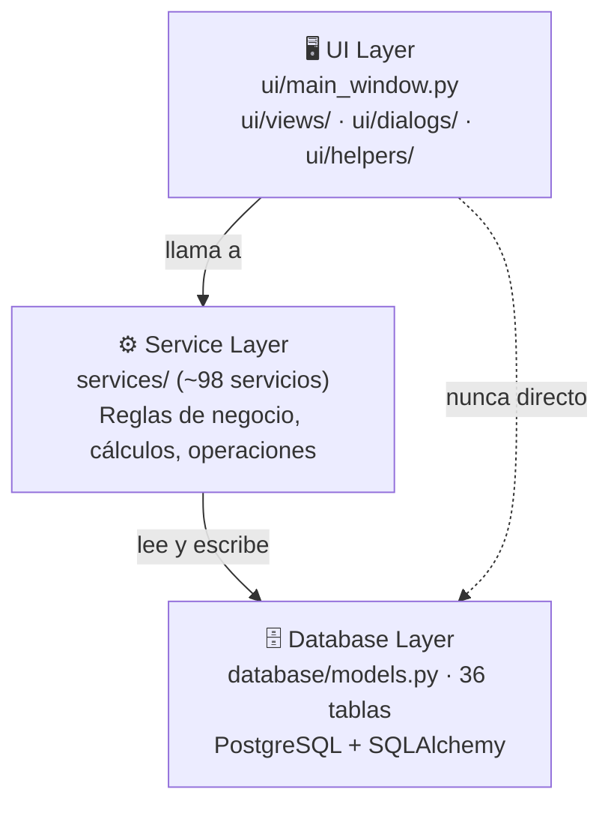
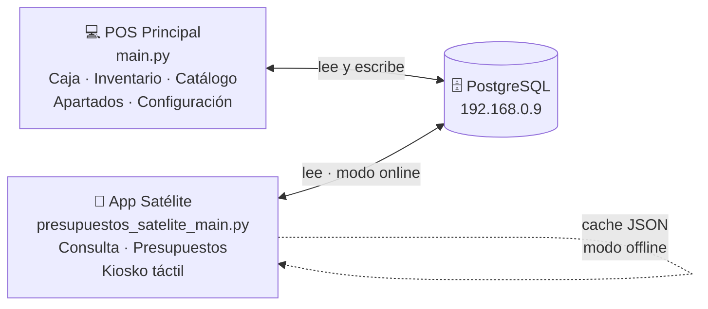

# Cómo leer este vault

> Esta es la guía de orientación. Si es la primera vez que abres este vault, empieza aquí.

---

## ¿Qué es esto?

Una base de conocimiento viva del sistema **POS Uniformes** — un punto de venta en Python para una tienda de uniformes escolares. No es solo documentación: es el mapa del proyecto, el log de decisiones, y el panel de control del estado actual.

---

## Por dónde empezar

```
¿Qué quieres hacer?
│
├─ Ver el estado actual del proyecto     → [[00 - Índice General]]
├─ Saber qué toca hacer hoy              → [[21 - Sesión de Trabajo]]
├─ Buscar una IP, un PIN, un comando     → [[22 - Referencia Rápida]]
├─ Entender cómo funciona algo           → sigue leyendo esta nota
└─ Ver el historial de lo que se hizo   → [[21 - Historial de Sesiones]]
```

---

## La lógica del sistema en 3 capas



> La UI **nunca** toca la base de datos directamente. Todo pasa por un servicio.

---

## Las dos apps del sistema



---

## Cómo navegar las notas

### Por número (flujo lógico)
| Rango | Contenido |
|-------|-----------|
| `00` | Dashboard — estado actual, qué toca |
| `01–03` | Arquitectura, BD, módulos UI |
| `04–13` | Servicios por dominio (el "motor" del sistema) |
| `14–16` | Flujos operativos paso a paso |
| `17` | App Satélite — arquitectura y roadmap |
| `18–20` | Estado del proyecto: tests, deuda técnica, pendientes |
| `21–22` | Trabajo diario: sesión activa, referencia rápida |
| `23` | Esta nota |

### Por el grafo (vista visual)
Abre el **Graph View** (`Ctrl+G`). Los colores son:
- 🔵 Azul → Arquitectura
- 🟣 Morado → Servicios
- 🟠 Naranja → Flujos
- 🟢 Verde → Satélite
- 🟡 Amarillo → Estado del proyecto
- 🟤 Café → Sesiones y referencia
- ⚪ Blanco → Índice (hub central)

### Por pregunta
| Si quieres saber... | Ve a... |
|--------------------|---------|
| ¿Cómo funciona una venta? | [[14 - Flujo de Venta]] |
| ¿Cómo funciona un apartado? | [[15 - Flujo de Apartado]] |
| ¿Cómo funciona el satélite? | [[17 - App Satélite]] |
| ¿Qué servicios existen? | [[04 - Servicios - Ventas]] al [[13 - Servicios - Utilidades]] |
| ¿Qué tablas hay en la BD? | [[02 - Base de Datos]] |
| ¿Qué tiene tests? | [[18 - Cobertura de Tests]] |
| ¿Qué deuda técnica hay? | [[19 - Deuda Técnica]] |
| ¿Qué falta por cerrar? | [[20 - Pendientes y Fase 5]] |

---

## Cómo se mantiene actualizado

Al cerrar cada sesión de trabajo:
1. Los cambios de código se registran en [[21 - Sesión de Trabajo]]
2. Las notas afectadas (servicios, flujos, estado) se actualizan
3. Al final de la sesión, el log se mueve a [[21 - Historial de Sesiones]]
4. El [[00 - Índice General]] refleja siempre el estado actual de la rama

> Si una nota contradice el código — el código manda. La nota hay que actualizarla.

---

## Convenciones visuales

| Callout | Significa |
|---------|-----------|
| `[!success]` | Todo bien, completado |
| `[!warning]` | Pendiente, requiere atención |
| `[!danger]` | Regla que no se debe romper |
| `[!info]` | Dato de referencia |
| `[!tip]` | Consejo práctico |
| `✅` en texto | Resuelto / completado |
| `⚠️` en texto | Pendiente / precaución |

---

## Ver también
- [[00 - Índice General]] — dashboard del proyecto
- [[01 - Arquitectura General]] — capas y reglas del sistema
- [[22 - Referencia Rápida]] — datos operativos
